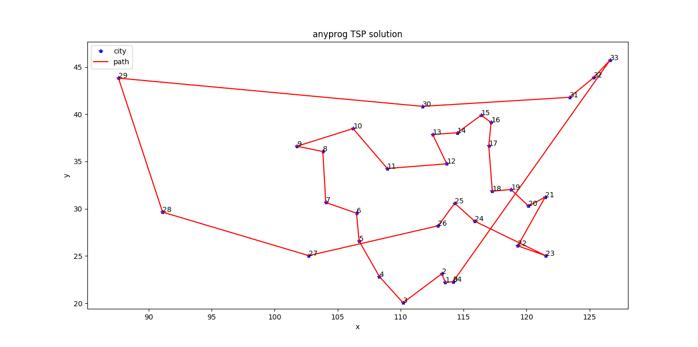
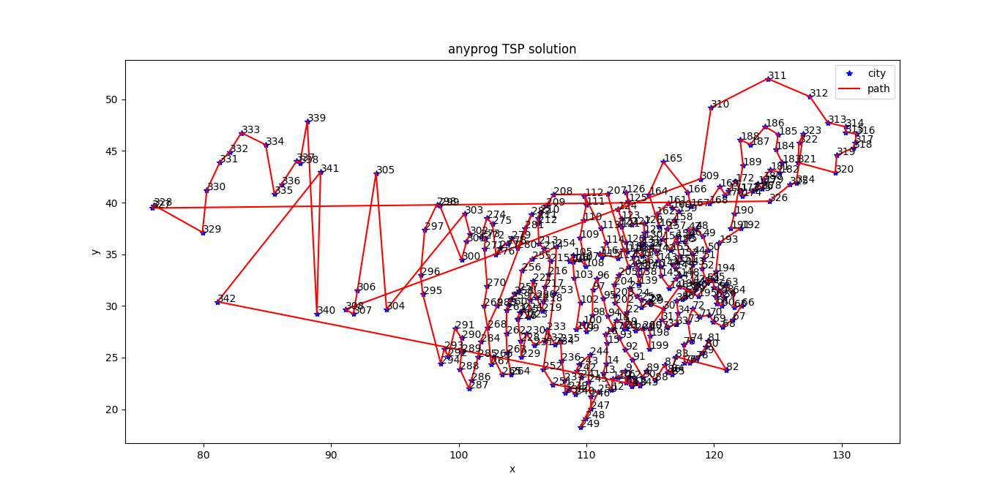

# anyprog
A C++ scientific library for mathematical programming,data fitting and solving nonlinear equations

# feature
- [anyprog](#anyprog)
- [feature](#feature)
- [usage](#usage)
  - [mathematical programming](#mathematical-programming)
    - [nonlinear-unconstrained-optimization](#nonlinear-unconstrained-optimization)
      - [example-1](#example-1)
      - [example-2](#example-2)
      - [example-3](#example-3)
    - [nonlinear-constrained-optimization](#nonlinear-constrained-optimization)
      - [example-1](#example-1-1)
      - [example-2](#example-2-1)
      - [example-3](#example-3-1)
      - [example-4](#example-4)
    - [linear-optimization](#linear-optimization)
    - [quadratic-optimazition](#quadratic-optimazition)
    - [mixed-integer-optimazition](#mixed-integer-optimazition)
      - [example-1](#example-1-2)
      - [example-2](#example-2-2)
      - [example-3](#example-3-2)
    - [any-optimazition](#any-optimazition)
      - [example-1](#example-1-3)
      - [example-2](#example-2-3)
      - [example-3](#example-3-3)
      - [example-4](#example-4-1)
      - [example-5](#example-5)
      - [example-6](#example-6)
      - [example-7](#example-7)
  - [data fitting](#data-fitting)
    - [polynomial-fitting](#polynomial-fitting)
    - [nonlinear-fitting](#nonlinear-fitting)
  - [solving nonlinear equations](#solving-nonlinear-equations)
    - [example-1](#example-1-4)
    - [example-2](#example-2-4)


# usage
`pkg-config --libs --cflags anyprog`

## mathematical programming

### nonlinear-unconstrained-optimization
#### example-1
```cpp
#include <anyprog/anyprog.hpp>
#include <chrono>
#include <fstream>
#include <iostream>

int main(int argc, char** argv)
{
    auto output = [](const anyprog::real_block& ret, const anyprog::optimization::funcation_t& obj) {
        std::cout << "solution:\n";
        for (size_t i = 0; i < ret.rows(); ++i) {
            std::cout << "x(" << i << ")=\t" << ret(i, 0) << "\n";
        }
        std::cout << "object=\t" << obj(ret) << "\n\n";
    };

    anyprog::optimization::funcation_t obj = [](const anyprog::real_block& x) {
        return 100 * pow(x(1, 0) - pow(x(0, 0), 2), 2) + pow(1 - x(0, 0), 2);
    };

    std::vector<anyprog::optimization::range_t> range = { { -10, 10 }, { -10, 10 } };
    output(anyprog::optimization::fminbnd(obj, range, 1e-10), obj);

    anyprog::real_block param(2, 1);
    param(0, 0) = 0;
    param(1, 0) = 0;
    output(anyprog::optimization::fminunc(obj, param, 1e-10), obj);

    auto grad = [&](const anyprog::real_block& x) {
        anyprog::real_block ret(x.rows(), 1);
        ret(0, 0) = 2 * x(0) - 400 * x(0) * (x(1) - pow(x(0), 2)) - 2;
        ret(1, 0) = 200 * x(1) - 200 * pow(x(0), 2);
        return ret;
    };
    output(anyprog::optimization::fminunc(obj, grad, param), obj);

    return 0;
}

```
```txt
solution:
x(0)=	0.999986
x(1)=	0.999971
object=	2.16042e-10

solution:
x(0)=	1
x(1)=	1
object=	3.05615e-14

solution:
x(0)=	1
x(1)=	1
object=	3.56293e-17

```

#### example-2
```cpp
#include <anyprog/anyprog.hpp>
#include <chrono>
#include <fstream>
#include <iostream>

int main(int argc, char** argv)
{
    anyprog::optimization::funcation_t obj = [](const anyprog::real_block& x) {
        return 100 * pow(x(1, 0) - pow(x(0, 0), 2), 2) + pow(1 - x(0, 0), 2);
    };
    std::vector<anyprog::optimization::range_t> range = { { -10, 10 }, { -10, 10 } };
    anyprog::optimization opt(obj, range);
    auto ret = opt.search();

    std::cout << "global solution:\n";
    for (size_t i = 0; i < ret.rows(); ++i) {
        std::cout << "x(" << i << ")=\t" << ret(i, 0) << "\n";
    }
    std::cout << "object=\t" << opt.obj(ret) << "\n\n";

    auto history = opt.get_history();
    std::cout << "search history:\n";
    for (auto& iter : history) {
        for (size_t i = 0; i < iter.second.rows(); ++i) {
            std::cout << "x(" << i << ")=\t" << iter.second(i, 0) << "\n";
        }
        std::cout << "object=\t" << iter.first << "\n\n";
    }

    return 0;
}
```
```txt
global solution:
x(0)=	1.0025
x(1)=	1.00506
object=	6.45722e-06

search history:
x(0)=	0.845278
x(1)=	0.713799
object=	0.0239873

x(0)=	1.09488
x(1)=	1.19905
object=	0.00901008

x(0)=	1.05482
x(1)=	1.11285
object=	0.00300943

x(0)=	0.963414
x(1)=	0.928027
object=	0.00134049

x(0)=	1.02463
x(1)=	1.05004
object=	0.000609679

x(0)=	1.02144
x(1)=	1.04345
object=	0.000460868

x(0)=	1.0025
x(1)=	1.00506
object=	6.45722e-06

```
#### example-3
```cpp
#include <anyprog/anyprog.hpp>
#include <chrono>
#include <fstream>
#include <iostream>

int main(int argc, char** argv)
{
    anyprog::optimization::funcation_t obj = [](const anyprog::real_block& x) {
        return x(0, 0) * sin(x(0, 0)) * cos(2.0 * x(0, 0)) - 2.0 * x(0, 0) * sin(3.0 * x(0, 0));
    };

    std::vector<anyprog::optimization::range_t> range = { { 0, 20 } };

    anyprog::optimization opt(obj, range);
    auto ret = opt.search(100, 10);

    std::cout << "global solution:\n";
    for (size_t i = 0; i < ret.rows(); ++i) {
        std::cout << "x(" << i << ")=\t" << ret(i, 0) << "\n";
    }
    std::cout << "object=\t" << opt.obj(ret) << "\n\n";

    auto history = opt.get_history();
    std::cout << "search history:\n";
    for (auto& iter : history) {
        for (size_t i = 0; i < iter.second.rows(); ++i) {
            std::cout << "x(" << i << ")=\t" << iter.second(i, 0) << "\n";
        }
        std::cout << "object=\t" << iter.first << "\n\n";
    }

    return 0;
}
```

```txt
global solution:
x(0)=	19.4114
object=	-34.0963

search history:
x(0)=	15.1613
object=	-26.6283

x(0)=	19.4114
object=	-34.0963
```

### nonlinear-constrained-optimization
#### example-1
```cpp
#include <anyprog/anyprog.hpp>
#include <chrono>
#include <fstream>
#include <iostream>

int main(int argc, char** argv)
{
    anyprog::optimization::funcation_t obj = [](const anyprog::real_block& x) {
        return -log(x(0)) - log(x(1));
    };

    std::vector<anyprog::optimization::inequation_condition_funcation_t> ineq;
    ineq.emplace_back([&](const anyprog::real_block& x) {
        return x(0) - x(1);
    });

    std::vector<anyprog::optimization::equation_condition_funcation_t> eq;
    eq.emplace_back([&](const anyprog::real_block& x) {
        return x(0) + 2 * x(1) - 5;
    });

    std::vector<anyprog::optimization::range_t> range = { { 0, 10 }, { 0, 10 } };

    anyprog::optimization opt(obj, range);
    opt.set_inequation_condition(ineq);
    opt.set_equation_condition(eq);
    auto ret = opt.solve();

    std::cout << "solution:\n";
    for (size_t i = 0; i < ret.rows(); ++i) {
        std::cout << "x(" << i << ")=\t" << ret(i, 0) << "\n";
    }
    std::cout << "object=\t" << opt.obj(ret) << "\n";

    return 0;
}
```
```txt
solution:
x(0)=	1.66667
x(1)=	1.66667
object=	-1.02165

```
#### example-2
```cpp
#include <anyprog/anyprog.hpp>
#include <chrono>
#include <fstream>
#include <iostream>

int main(int argc, char** argv)
{
    anyprog::optimization::funcation_t obj = [](const anyprog::real_block& x) {
        return pow(1 - x(0), 2) + 100 * pow(x(1) - pow(x(0), 2), 2);
    };

    std::vector<anyprog::optimization::inequation_condition_funcation_t> ineq;
    ineq.emplace_back([&](const anyprog::real_block& x) {
        return pow(x(0) - 1. / 3., 2) + pow(x(1) - 1. / 3., 2) - pow(1. / 3., 2);
    });

    ineq.emplace_back([&](const anyprog::real_block& x) {
        return x(0) + x(1) - 2;
    });

    ineq.emplace_back([&](const anyprog::real_block& x) {
        return x(0) - 2 * x(1) - 3;
    });

    std::vector<anyprog::optimization::range_t> range = { { 0, 0.5 }, { 0.2, 0.8 } };

    anyprog::optimization opt(obj, range);
    opt.set_inequation_condition(ineq);
    auto ret = opt.solve();

    std::cout << "solution:\n";
    for (size_t i = 0; i < ret.rows(); ++i) {
        std::cout << "x(" << i << ")=\t" << ret(i, 0) << "\n";
    }
    std::cout << "object=\t" << opt.obj(ret) << "\n";
    return 0;
}
```
```txt
solution:
x(0)=	0.5
x(1)=	0.250026
object=	0.25

```
#### example-3
```cpp
#include <anyprog/anyprog.hpp>
#include <chrono>
#include <fstream>
#include <iostream>

int main(int argc, char** argv)
{
    size_t dim = 6;
    anyprog::optimization::funcation_t obj = [&](const anyprog::real_block& x) {
        return sqrt(pow(x(0) - x(1), 2) + pow(x(3) - x(4), 2)) + sqrt(pow(x(0) - x(2), 2) + pow(x(3) - x(5), 2)) + sqrt(pow(x(2) - x(1), 2) + pow(x(5) - x(4), 2));
    };
    std::vector<anyprog::optimization::inequation_condition_funcation_t> ineq;
    ineq.emplace_back([&](const anyprog::real_block& x) {
        return pow(x(0) - 5, 2) + pow(x(3) - 4, 2) - 4;
    });
    ineq.emplace_back([&](const anyprog::real_block& x) {
        return pow(x(1) + 5, 2) + pow(x(4) + 3, 2) - 1;
    });
    ineq.emplace_back([&](const anyprog::real_block& x) {
        return pow(x(2) + 1, 2) + pow(x(5) - 1, 2) - 1;
    });

    std::vector<anyprog::optimization::range_t> range;
    for (size_t i = 0; i < dim; ++i) {
        range.push_back({ -100, 100 });
    }
    anyprog::optimization opt(obj, range);
    opt.set_inequation_condition(ineq);
    auto ret = opt.search(100, 10);

    std::cout << "global solution:\n";
    for (size_t i = 0; i < ret.rows(); ++i) {
        std::cout << "x(" << i << ")=\t" << ret(i, 0) << "\n";
    }
    std::cout << "object=\t" << opt.obj(ret) << "\n\n";

    auto history = opt.get_history();
    std::cout << "search history:\n";
    for (auto& iter : history) {
        for (size_t i = 0; i < iter.second.rows(); ++i) {
            std::cout << "x(" << i << ")=\t" << iter.second(i, 0) << "\n";
        }
        std::cout << "object=\t" << iter.first << "\n\n";
    }

    return 0;
}
```
```txt
global solution:
x(0)=	3.35966
x(1)=	-4.18107
x(2)=	-0.310501
x(3)=	2.85576
x(4)=	-2.4261
x(5)=	0.286241
object=	18.4131

search history:
x(0)=	3.36641
x(1)=	-4.18061
x(2)=	-0.441214
x(3)=	2.84614
x(4)=	-2.42676
x(5)=	0.184949
object=	18.4132

x(0)=	3.36015
x(1)=	-4.18141
x(2)=	-0.244818
x(3)=	2.85507
x(4)=	-2.42562
x(5)=	0.344485
object=	18.4131

x(0)=	3.35966
x(1)=	-4.18107
x(2)=	-0.310501
x(3)=	2.85576
x(4)=	-2.4261
x(5)=	0.286241
object=	18.4131

```
#### example-4
```cpp
#include <anyprog/anyprog.hpp>
#include <chrono>
#include <fstream>
#include <iostream>

int main(int argc, char** argv)
{
    //https://www.coin-or.org/Ipopt/documentation/node20.html
    anyprog::optimization::funcation_t obj = [](const anyprog::real_block& x) {
        return x(0) * x(3) * (x(0) + x(1) + x(2)) + x(2);
    };
    std::vector<anyprog::optimization::inequation_condition_funcation_t> ineq;
    ineq.emplace_back([](const anyprog::real_block& x) {
        return 25 - x.prod();
    });
    std::vector<anyprog::optimization::equation_condition_funcation_t> eq;
    eq.emplace_back([](const anyprog::real_block& x) {
        size_t dim = x.rows();
        double sum = 0;
        for (size_t i = 0; i < dim; ++i) {
            sum += pow(x(i), 2);
        }
        return sum - 40;
    });
    std::vector<anyprog::optimization::range_t> range = { { 1, 5 }, { 1, 5 }, { 1, 5 }, { 1, 5 } };
    anyprog::real_block param(4, 1);
    param << 1, 5, 5, 1;
    anyprog::optimization opt(obj, param, range);
    opt.set_equation_condition(eq).set_inequation_condition(ineq);
    auto ret = opt.solve();
    if (opt.is_ok()) {
        std::cout << "solution:\n";
        for (size_t i = 0; i < ret.rows(); ++i) {
            std::cout << "x(" << i << ")=\t" << ret(i, 0) << "\n";
        }
        std::cout << "object:\t" << obj(ret) << "\n";
    } else {
        std::cout << "Not found.\n";
    }

    return 0;
}
```
```txt
solution:
x(0)=	1
x(1)=	4.74303
x(2)=	3.82112
x(3)=	1.37941
object:	17.014
```

### linear-optimization
```cpp
#include <anyprog/anyprog.hpp>
#include <chrono>
#include <fstream>
#include <iostream>

int main(int argc, char** argv)
{
    anyprog::real_block obj(3, 1);
    obj << -5, -4, -6;

    anyprog::real_block A(3, 3), b(3, 1);
    A << 1, -1, 1, 3, 2, 4, 3, 2, 0;
    b << 20, 42, 30;

    std::vector<anyprog::optimization::range_t> range = { { 0, 20 }, { 0, 20 }, { 0, 20 } };

    anyprog::optimization opt(obj, range);
    opt.set_inequation_condition(A, b);
    anyprog::real_block ret = opt.solve();

    std::cout << "solution:\n";
    for (size_t i = 0; i < ret.rows(); ++i) {
        std::cout << "x(" << i << ")=\t" << ret(i, 0) << "\n";
    }
    std::cout << "object=\t" << opt.obj(ret) << "\n";

    return 0;
}
```
```txt
solution:
x(0)=	3.9968e-15
x(1)=	15
x(2)=	3
object=	-78
```

### quadratic-optimazition
```cpp
#include <anyprog/anyprog.hpp>
#include <chrono>
#include <fstream>
#include <iostream>

int main(int argc, char** argv)
{
    anyprog::real_block h(2, 2);
    h << 2, -1, -1, 4;
    anyprog::real_block c(1, 2);
    c << -1, -10;

    anyprog::optimization::funcation_t obj = [&](const anyprog::real_block& x) {
        anyprog::real_block ret = 0.5 * (x.transpose() * h * x) + c * x;
        return ret(0, 0);
    };

    anyprog::real_block A(1, 2);
    A << 3, 2;
    anyprog::real_block b(1, 1);
    b << 6;

    std::vector<anyprog::optimization::range_t> range = { { 0, 10 }, { 0, 10 } };

    anyprog::optimization opt(obj, range);
    opt.set_inequation_condition(A, b);

    auto ret = opt.solve();

    std::cout << "solution:\n";
    for (size_t i = 0; i < ret.rows(); ++i) {
        std::cout << "x(" << i << ")=\t" << ret(i, 0) << "\n";
    }
    std::cout << "object=\t" << opt.obj(ret) << "\n";
    return 0;
}
```
```txt
solution:
x(0)=	0.499887
x(1)=	2.25017
object=	-13.75

```

### mixed-integer-optimazition
#### example-1
```cpp
#include <anyprog/anyprog.hpp>
#include <chrono>
#include <fstream>
#include <iostream>

int main(int argc, char** argv)
{
    size_t dim = 4;
    anyprog::real_block obj(dim, 1);
    obj << 3, 7, -1, 1;

    anyprog::real_block A(3, dim);
    A << -2, 1, -1, 1, -1, 1, -6, -4, -5, -3, 0, -1;

    anyprog::real_block b(3, 1);
    b << -1, -6, -5;

    std::vector<anyprog::optimization::range_t> range;
    for (size_t i = 0; i < dim; ++i) {
        range.push_back({ 0, 1 });
    }

    anyprog::optimization opt(obj, range);
    opt.set_inequation_condition(A, b)
        .set_enable_binary_filter();

    auto ret = opt.search(100, 10);

    std::cout << "global solution:\n";
    for (size_t i = 0; i < ret.rows(); ++i) {
        std::cout << "x(" << i << ")=\t" << ret(i, 0) << "\n";
    }
    std::cout << "object=\t" << opt.obj(ret) << "\n\n";

    auto history = opt.get_history();
    std::cout << "search history:\n";
    for (auto& iter : history) {
        for (size_t i = 0; i < iter.second.rows(); ++i) {
            std::cout << "x(" << i << ")=\t" << iter.second(i, 0) << "\n";
        }
        std::cout << "object=\t" << iter.first << "\n\n";
    }

    return 0;
}
```
```txt
global solution:
x(0)=	1
x(1)=	0
x(2)=	1
x(3)=	0
object=	2

search history:
x(0)=	1
x(1)=	1
x(2)=	1
x(3)=	0
object=	9

x(0)=	1
x(1)=	0
x(2)=	1
x(3)=	1
object=	3

x(0)=	1
x(1)=	0
x(2)=	1
x(3)=	0
object=	2

```
#### example-2
```cpp
#include <anyprog/anyprog.hpp>
#include <chrono>
#include <fstream>
#include <iostream>

int main(int argc, char** argv)
{
    anyprog::optimization::funcation_t obj = [](const anyprog::real_block& x) {
        return pow(x(0) - 1, 2) + pow(x(1) - 1, 2) + pow(x(2) - 1, 2) - log(1 + x(3)) + pow(x(4) - 1, 2) + pow(x(5) - 2, 2) + pow(x(6) - 3, 2);
    };
    std::vector<anyprog::optimization::inequation_condition_funcation_t> ineq;
    ineq.emplace_back([](const anyprog::real_block& x) {
        return x.sum() - x(3) - 5;
    });
    ineq.emplace_back([](const anyprog::real_block& x) {
        return pow(x(2), 2) + pow(x(4), 2) + pow(x(5), 2) + pow(x(6), 2) - 5.5;
    });
    ineq.emplace_back([](const anyprog::real_block& x) {
        return x(0) + x(4) - 1.2;
    });
    ineq.emplace_back([](const anyprog::real_block& x) {
        return x(1) + x(5) - 1.8;
    });
    ineq.emplace_back([](const anyprog::real_block& x) {
        return x(2) + x(6) - 2.5;
    });
    ineq.emplace_back([](const anyprog::real_block& x) {
        return x(3) + x(4) - 1.2;
    });
    ineq.emplace_back([](const anyprog::real_block& x) {
        return pow(x(1), 2) + pow(x(5), 2) - 1.64;
    });
    ineq.emplace_back([](const anyprog::real_block& x) {
        return pow(x(2), 2) + pow(x(6), 2) - 4.25;
    });
    ineq.emplace_back([](const anyprog::real_block& x) {
        return pow(x(1), 2) + pow(x(6), 2) - 4.64;
    });

    anyprog::real_block param(7, 1);
    param << 1, 1, 1, 1, 1, 1, 1;

    anyprog::optimization opt(obj, param);
    opt.set_inequation_condition(ineq);
    opt.set_filter_function([](anyprog::real_block& x) {
        x(0, 0) = round(x(0, 0));
        x(1, 0) = round(x(1, 0));
        x(2, 0) = round(x(2, 0));
        x(3, 0) = round(x(3, 0));
    });
    auto ret = opt.search();
    if (opt.is_ok()) {
        std::cout << "golbal solution:\n";
        for (size_t i = 0; i < ret.rows(); ++i) {
            std::cout << "x(" << i << ")=\t" << ret(i, 0) << "\n";
        }
        std::cout << "object:\t" << obj(ret) << "\n";
    } else {
        std::cout << "Not found.\n";
    }

    return 0;
}
```
```txt
golbal solution:
x(0)=	1
x(1)=	0
x(2)=	0
x(3)=	1
x(4)=	0.2
x(5)=	1.28062
x(6)=	1.95448
object:	3.55746
```
#### example-3

```cpp
#include <anyprog/anyprog.hpp>
#include <chrono>
#include <fstream>
#include <iostream>

int main(int argc, char** argv)
{
    size_t dim = 4;
    anyprog::real_block obj(dim, 1);
    obj << -1, -1, -2, 2;
    anyprog::real_block Aeq(1, dim), beq(1, 1), A(3, dim), b(3, 1);
    Aeq << 1, 1, 1, 1;
    beq << 10;
    A << 1, 0, 2, 0, 0, 2, -8, 0, 0, -1, 2, -1;
    b << 700, 0, -1;

    std::vector<anyprog::optimization::range_t> range;
    for (size_t i = 0; i < dim; ++i) {
        range.push_back({ 0, 10 });
    }
    anyprog::optimization opt(obj, range);
    opt.set_equation_condition(Aeq, beq).set_inequation_condition(A, b);
    opt.set_enable_integer_filter();
    anyprog::real_block ret = opt.search();
    if (opt.is_ok()) {
        std::cout << "global solution:\n";
        for (size_t i = 0; i < ret.rows(); ++i) {
            std::cout << "x(" << i << ")=\t" << ret(i, 0) << "\n";
        }
        std::cout << "object:\t" << ret.transpose() * obj << "\n\n";

        auto history = opt.get_history();
        std::cout << "search history:\n";
        for (auto& iter : history) {
            for (size_t i = 0; i < iter.second.rows(); ++i) {
                std::cout << "x(" << i << ")=\t" << iter.second(i, 0) << "\n";
            }
            std::cout << "object=\t" << iter.first << "\n\n";
        }
    } else {
        std::cout << "Not found.\n";
    }

    return 0;
}
```
```txt
global solution:
x(0)=	0
x(1)=	7
x(2)=	3
x(3)=	0
object:	-13

search history:
x(0)=	4
x(1)=	3
x(2)=	1
x(3)=	2
object=	-5

x(0)=	0
x(1)=	6
x(2)=	3
x(3)=	1
object=	-10

x(0)=	5
x(1)=	4
x(2)=	1
x(3)=	0
object=	-11

x(0)=	3
x(1)=	5
x(2)=	2
x(3)=	0
object=	-12

x(0)=	0
x(1)=	7
x(2)=	3
x(3)=	0
object=	-13
```


### any-optimazition
#### example-1
```cpp
#include <anyprog/anyprog.hpp>
#include <chrono>
#include <fstream>
#include <iostream>

int main(int argc, char** argv)
{
    anyprog::optimization::funcation_t obj = [](const anyprog::real_block& x) {
        return x(0) * x(3) * (x(0) + x(1) + x(2)) + x(2);
    };

    std::vector<anyprog::optimization::equation_condition_funcation_t> eq;
    eq.emplace_back([](const anyprog::real_block& x) {
        double sum = 0;
        for (size_t i = 0; i < 4; ++i) {
            sum += pow(x(i), 2);
        }
        return sum - 40;
    });

    std::vector<anyprog::optimization::inequation_condition_funcation_t> ineq;
    ineq.emplace_back([](const anyprog::real_block& x) {
        return 25 - x(0) * x(1) * x(2) * x(3);
    });

    std::vector<anyprog::optimization::range_t> range = { { 1, 5 }, { 1, 5 }, { 1, 5 }, { 1, 5 } };

    anyprog::optimization opt(obj, range);

    opt.set_equation_condition(eq)
        .set_inequation_condition(ineq)
        .set_filter_function([](anyprog::real_block& x) {
            x(0, 0) = round(x(0, 0));
        });

    auto ret = opt.search();
    std::cout << "global solution:\n";
    for (size_t i = 0; i < ret.rows(); ++i) {
        std::cout << "x(" << i << ")=\t" << ret(i, 0) << "\n";
    }
    std::cout << "object=\t" << opt.obj(ret) << "\n\n";

    auto history = opt.get_history();
    std::cout << "search history:\n";
    for (auto& iter : history) {
        for (size_t i = 0; i < iter.second.rows(); ++i) {
            std::cout << "x(" << i << ")=\t" << iter.second(i, 0) << "\n";
        }
        std::cout << "object=\t" << iter.first << "\n\n";
    }

    return 0;
}
```
```txt
global solution:
x(0)=	1
x(1)=	4.74309
x(2)=	3.82103
x(3)=	1.37942
object=	17.014

search history:
x(0)=	3
x(1)=	5
x(2)=	2.23607
x(3)=	1
object=	32.9443

x(0)=	2
x(1)=	3.16228
x(2)=	5
x(3)=	1
object=	25.3246

x(0)=	1
x(1)=	4.74309
x(2)=	3.82103
x(3)=	1.37942
object=	17.014
```
#### example-2
```cpp
#include <anyprog/anyprog.hpp>
#include <chrono>
#include <fstream>
#include <iostream>

int main(int argc, char** argv)
{
    //https://uk.mathworks.com/help/optim/ug/mixed-integer-linear-programming-basics.html
    anyprog::real_block obj(8, 1);
    obj << 350 * 5, 330 * 3, 310 * 4, 280 * 6, 500, 450, 400, 100;
    anyprog::real_block Aeq(3, 8), beq(3, 1);
    Aeq << 5, 3, 4, 6, 1, 1, 1, 1,
        5 * 0.05, 3 * 0.04, 4 * 0.05, 6 * 0.03, 0.08, 0.07, 0.06, 0.03,
        5 * 0.03, 3 * 0.03, 4 * 0.04, 6 * 0.04, 0.06, 0.07, 0.08, 0.09;
    beq << 25, 1.25, 1.25;
    std::vector<anyprog::optimization::range_t> range = { { 0, 1 }, { 0, 1 }, { 0, 1 }, { 0, 1 }, { 0, 10 }, { 0, 10 }, { 0, 10 }, { 0, 10 } };
    anyprog::optimization opt(obj, range);
    opt.set_equation_condition(Aeq, beq);
    opt.set_filter_function([](anyprog::real_block& x) {
        x(0, 0) = round(x(0, 0));
        x(1, 0) = round(x(1, 0));
        x(2, 0) = round(x(2, 0));
        x(3, 0) = round(x(3, 0));
    });
    auto ret = opt.search();
    if (opt.is_ok()) {
        std::cout << "solution:\n"
                  << ret << "\n";
        std::cout << "object:\t" << ret.transpose() * obj << "\n";
    } else {
        std::cout << "Not found.\n";
    }

    return 0;
}
```
```txt
solution:
       1
       1
       0
       1
 7.13349
0.233014
0.133493
     3.5
object:	8495

```
#### example-3
```cpp
#include <anyprog/anyprog.hpp>
#include <chrono>
#include <fstream>
#include <iostream>

int main(int argc, char** argv)
{
    //https://www.geeksforgeeks.org/job-assignment-problem-using-branch-and-bound/
    anyprog::real_block c(4, 4);
    c << 9, 2, 7, 8,
        6, 4, 3, 7,
        5, 8, 1, 8,
        7, 6, 9, 4;
    anyprog::optimization::assignment assignment(c);
    auto path = assignment.solve();
    anyprog::real_block s(4, 4);
    for (auto& i : path) {
        s(i.first, i.second) = 1;
    }
    std::cout << assignment.obj() << "\n"
              << s << "\n";
    return 0;
}
```
```txt
13
0 1 0 0
1 0 0 0
0 0 1 0
0 0 0 1
```
#### example-4

```cpp
#include <anyprog/anyprog.hpp>
#include <chrono>
#include <fstream>
#include <iostream>


int main(int argc, char** argv)
{
    //Travelling Salesman Problem
    anyprog::real_block c(4, 4);
    c << 0, 500, 600, 100,
        100, 0, 800, 500,
        1000, 200, 0, 2000,
        400, 400, 100, 0;
    std::cout << c << "\n\n";
    anyprog::optimization::tsp tsp(c);
    auto path = tsp.solve();
    std::cout << "path=|";
    for (auto& i : path) {
        std::cout << i << "|";
    }
    std::cout << "\ndistance="
              << tsp.obj() << "\n";
    return 0;
}
```
```txt
   0  500  600  100
 100    0  800  500
1000  200    0 2000
 400  400  100    0

path=|0|3|2|1|0|
distance=500

```

#### example-5

```cpp
#include <anyprog/anyprog.hpp>
#include <chrono>
#include <fstream>
#include <iostream>

int main(int argc, char** argv)
{
    //https://blog.csdn.net/haohaoliu_/article/details/83024664
    std::vector<std::pair<std::string, std::pair<double, double>>> city_and_gps = {
        { "香港", { 114.165460, 22.275340 } },
        { "澳门", { 113.549130, 22.198750 } },
        { "上海市", { 121.472641, 31.231707 } },
        { "武汉市", { 114.298569, 30.584354 } },
        { "南京市", { 118.76741, 32.041546 } },
        { "合肥市", { 117.283043, 31.861191 } },
        { "长沙市", { 112.982277, 28.19409 } },
        { "南昌市", { 115.892151, 28.676493 } },
        { "杭州市", { 120.15358, 30.287458 } },
        { "福州市", { 119.306236, 26.075302 } },
        { "广州市", { 113.28064, 23.125177 } },
        { "台北市", { 121.5200760, 25.0307240 } },
        { "海口市", { 110.199890, 20.044220 } },
        { "南宁市", { 108.320007, 22.82402 } },
        { "重庆市", { 106.504959, 29.533155 } },
        { "昆明市", { 102.71225, 25.040609 } },
        { "贵阳市", { 106.713478, 26.578342 } },
        { "成都市", { 104.065735, 30.659462 } },
        { "沈阳市", { 123.429092, 41.796768 } },
        { "长春市", { 125.324501, 43.886841 } },
        { "哈尔滨市", { 126.642464, 45.756966 } },
        { "北京市", { 116.405289, 39.904987 } },
        { "天津市", { 117.190186, 39.125595 } },
        { "呼和浩特市", { 111.751990, 40.841490 } },
        { "银川市", { 106.232480, 38.486440 } },
        { "太原市", { 112.549248, 37.857014 } },
        { "石家庄市", { 114.502464, 38.045475 } },
        { "济南市", { 117.000923, 36.675808 } },
        { "郑州市", { 113.665413, 34.757977 } },
        { "西安市", { 108.948021, 34.263161 } },
        { "兰州市", { 103.834170, 36.061380 } },
        { "西宁市", { 101.777820, 36.617290 } },
        { "拉萨市", { 91.11450, 29.644150 } },
        { "乌鲁木齐市", { 87.616880, 43.826630 } }
    };
    std::vector<std::pair<double, double>> gps;
    for (auto& i : city_and_gps) {
        gps.push_back(i.second);
    }
    anyprog::real_block dis = anyprog::optimization::tsp::gps_euclidean_distance(gps);
    anyprog::optimization::tsp tsp(dis);
    auto path = tsp.solve();
    std::cout << "path=|";
    for (size_t i = 0; i < path.size(); ++i) {
        std::cout << city_and_gps[path[i]].first << "|";
    }
    std::cout << "\ndistance="
              << tsp.obj() << " km\n";
    return 0;
}
```
```txt
path=|香港|澳门|广州市|海口市|南宁市|贵阳市|重庆市|成都市|兰州市|西宁市|银川市|西安市|郑州市|太原市|石家庄市|北京市|天津市|济南市|合肥市|南京市|杭州市|上海市|福州市|台北市|南昌市|武汉市|长沙市|昆明市|拉萨市|乌鲁木齐市|呼和浩特市|沈阳市|长春市|哈尔滨市|香港|
distance=188.344
```
#### example-6

```cpp
#include <anyprog/anyprog.hpp>
#include <chrono>
#include <fstream>
#include <iostream>

int main(int argc, char** argv)
{
    //https://blog.csdn.net/qq_32371887/article/details/78839062
    std::vector<std::pair<std::string, std::pair<double, double>>> city_and_gps = {
        { "香港特别行政区", { 114.186124, 22.293586 } },
        { "澳门特别行政区", { 113.557519, 22.204118 } },
        { "台湾省", { 120.961454, 23.80406 } },
        { "北京市", { 116.395645, 39.929986 } },
        { "天津市", { 117.210813, 39.14393 } },
        { "上海市", { 121.487899, 31.249162 } },
        { "重庆市", { 106.530635, 29.544606 } },
        //新疆维吾尔自治区
        { "克拉玛依市", { 84.88118, 45.594331 } },
        { "乌鲁木齐市", { 87.564988, 43.84038 } },
        { "巴音郭楞蒙古自治州", { 86.121688, 41.771362 } },
        { "伊犁哈萨克自治州", { 81.297854, 43.922248 } },
        { "吐鲁番地区", { 89.181595, 42.96047 } },
        { "阿勒泰地区", { 88.137915, 47.839744 } },
        { "哈密地区", { 93.528355, 42.858596 } },
        { "博尔塔拉蒙古自治州", { 82.052436, 44.913651 } },
        { "阿克苏地区", { 80.269846, 41.171731 } },
        { "克孜勒苏柯尔克孜自治州", { 76.137564, 39.750346 } },
        { "昌吉回族自治州", { 87.296038, 44.007058 } },
        { "喀什地区", { 75.992973, 39.470627 } },
        { "和田地区", { 79.930239, 37.116774 } },
        { "塔城地区", { 82.974881, 46.758684 } },
        { "新疆维吾尔自治区省直辖行政单位", { 85.564988, 40.84038 } },
        { "崇左市", { 107.357322, 22.415455 } },
        { "柳州市", { 109.422402, 24.329053 } },
        { "百色市", { 106.631821, 23.901512 } },
        { "南宁市", { 108.297234, 22.806493 } },
        { "梧州市", { 111.305472, 23.485395 } },
        { "北海市", { 109.122628, 21.472718 } },
        { "桂林市", { 110.26092, 25.262901 } },
        { "河池市", { 108.069948, 24.699521 } },
        { "贵港市", { 109.613708, 23.103373 } },
        { "钦州市", { 108.638798, 21.97335 } },
        { "来宾市", { 109.231817, 23.741166 } },
        { "防城港市", { 108.351791, 21.617398 } },
        { "贺州市", { 111.552594, 24.411054 } },
        { "玉林市", { 110.151676, 22.643974 } },
        // 西藏自治区
        { "山南地区", { 91.750644, 29.229027 } },
        { "那曲地区", { 92.067018, 31.48068 } },
        { "阿里地区", { 81.107669, 30.404557 } },
        { "拉萨市", { 91.111891, 29.662557 } },
        { "昌都地区", { 97.185582, 31.140576 } },
        { "林芝地区", { 94.349985, 29.666941 } },
        { "日喀则地区", { 88.891486, 29.269023 } },
        //宁夏回族自治区
        { "银川市", { 106.206479, 38.502621 } },
        { "吴忠市", { 106.208254, 37.993561 } },
        { "中卫市", { 105.196754, 37.521124 } },
        { "石嘴山市", { 106.379337, 39.020223 } },
        { "固原市", { 106.285268, 36.021523 } },
        // 内蒙古自治区
        { "乌海市", { 106.831999, 39.683177 } },
        { "鄂尔多斯市", { 109.993706, 39.81649 } },
        { "兴安盟", { 122.048167, 46.083757 } },
        { "锡林郭勒盟", { 116.02734, 43.939705 } },
        { "巴彦淖尔市", { 107.423807, 40.76918 } },
        { "赤峰市", { 118.930761, 42.297112 } },
        { "乌兰察布市", { 113.112846, 41.022363 } },
        { "呼伦贝尔市", { 119.760822, 49.201636 } },
        { "通辽市", { 122.260363, 43.633756 } },
        { "阿拉善盟", { 105.695683, 38.843075 } },
        { "包头市", { 109.846239, 40.647119 } },
        { "呼和浩特市", { 111.660351, 40.828319 } },
        //四川省
        { "遂宁市", { 105.564888, 30.557491 } },
        { "雅安市", { 103.009356, 29.999716 } },
        { "巴中市", { 106.757916, 31.869189 } },
        { "攀枝花市", { 101.722423, 26.587571 } },
        { "自贡市", { 104.776071, 29.359157 } },
        { "凉山彝族自治州", { 102.259591, 27.892393 } },
        { "广元市", { 105.819687, 32.44104 } },
        { "广安市", { 106.63572, 30.463984 } },
        { "宜宾市", { 104.633019, 28.769675 } },
        { "达州市", { 107.494973, 31.214199 } },
        { "南充市", { 106.105554, 30.800965 } },
        { "成都市", { 104.067923, 30.679943 } },
        { "内江市", { 105.073056, 29.599462 } },
        { "资阳市", { 104.633019, 28.769675 } },
        { "阿坝藏族羌族自治州", { 102.228565, 31.905763 } },
        { "甘孜藏族自治州", { 101.969232, 30.055144 } },
        { "绵阳市", { 104.705519, 31.504701 } },
        { "乐山市", { 103.760824, 29.600958 } },
        { "泸州市", { 105.44397, 28.89593 } },
        { "德阳市", { 104.402398, 31.13114 } },
        { "眉山市", { 103.84143, 30.061115 } },
        //陕西省
        { "安康市", { 109.038045, 32.70437 } },
        { "咸阳市", { 108.707509, 34.345373 } },
        { "渭南市", { 109.483933, 34.502358 } },
        { "汉中市", { 107.045478, 33.081569 } },
        { "延安市", { 109.50051, 36.60332 } },
        { "榆林市", { 109.745926, 38.279439 } },
        { "西安市", { 108.953098, 34.2778 } },
        { "铜川市", { 108.968067, 34.908368 } },
        { "宝鸡市", { 107.170645, 34.364081 } },
        { "商洛市", { 109.934208, 33.873907 } },
        // 河南省
        { "焦作市", { 113.211836, 35.234608 } },
        { "南阳市", { 112.542842, 33.01142 } },
        { "三门峡市", { 111.181262, 34.78332 } },
        { "平顶山市", { 113.300849, 33.745301 } },
        { "驻马店市", { 114.049154, 32.983158 } },
        { "新乡市", { 113.91269, 35.307258 } },
        { "许昌市", { 113.835312, 34.02674 } },
        { "洛阳市", { 112.447525, 34.657368 } },
        { "开封市", { 114.351642, 34.801854 } },
        { "安阳市", { 114.351807, 36.110267 } },
        { "周口市", { 114.654102, 33.623741 } },
        { "信阳市", { 114.085491, 32.128582 } },
        { "郑州市", { 113.649644, 34.75661 } },
        { "濮阳市", { 115.026627, 35.753298 } },
        { "商丘市", { 115.641886, 34.438589 } },
        { "漯河市", { 114.046061, 33.576279 } },
        { "鹤壁市", { 114.29777, 35.755426 } },
        //浙江省
        { "丽水市", { 119.929576, 28.4563 } },
        { "衢州市", { 118.875842, 28.95691 } },
        { "台州市", { 121.440613, 28.668283 } },
        { "宁波市", { 121.579006, 29.885259 } },
        { "杭州市", { 120.219375, 30.259244 } },
        { "金华市", { 119.652576, 29.102899 } },
        { "温州市", { 120.690635, 28.002838 } },
        { "绍兴市", { 120.592467, 30.002365 } },
        { "嘉兴市", { 120.760428, 30.773992 } },
        { "湖州市", { 120.137243, 30.877925 } },
        { "舟山市", { 122.169872, 30.03601 } },
        // 海南省
        { "海口市", { 110.330802, 20.022071 } },
        { "三亚市", { 109.522771, 18.257776 } },
        { "海南省省直辖县级行政单位", { 109.9267865, 19.1399235 } },
        { "运城市", { 111.006854, 35.038859 } },
        { "忻州市", { 112.727939, 38.461031 } },
        { "晋城市", { 112.867333, 35.499834 } },
        { "临汾市", { 111.538788, 36.099745 } },
        { "阳泉市", { 113.569238, 37.869529 } },
        { "长治市", { 113.120292, 36.201664 } },
        { "吕梁市", { 111.143157, 37.527316 } },
        { "太原市", { 112.550864, 37.890277 } },
        { "大同市", { 113.290509, 40.113744 } },
        { "朔州市", { 112.479928, 39.337672 } },
        { "晋中市", { 112.738514, 37.693362 } },
        // 广东省
        { "韶关市", { 113.594461, 24.80296 } },
        { "惠州市", { 114.410658, 23.11354 } },
        { "揭阳市", { 116.379501, 23.547999 } },
        { "云浮市", { 112.050946, 22.937976 } },
        { "深圳市", { 114.025974, 22.546054 } },
        { "潮州市", { 116.630076, 23.661812 } },
        { "清远市", { 113.040773, 23.698469 } },
        { "梅州市", { 116.126403, 24.304571 } },
        { "广州市", { 113.30765, 23.120049 } },
        { "东莞市", { 113.763434, 23.043024 } },
        { "江门市", { 113.078125, 22.575117 } },
        { "肇庆市", { 112.479653, 23.078663 } },
        { "茂名市", { 110.931245, 21.668226 } },
        { "阳江市", { 111.97701, 21.871517 } },
        { "汕尾市", { 115.372924, 22.778731 } },
        { "河源市", { 114.713721, 23.757251 } },
        { "中山市", { 113.42206, 22.545178 } },
        { "佛山市", { 113.134026, 23.035095 } },
        { "汕头市", { 116.72865, 23.383908 } },
        { "湛江市", { 110.365067, 21.257463 } },
        { "珠海市", { 113.562447, 22.256915 } },
        // 云南省
        { "怒江傈僳族自治州", { 98.859932, 25.860677 } },
        { "迪庆藏族自治州", { 99.713682, 27.831029 } },
        { "昭通市", { 103.725021, 27.340633 } },
        { "西双版纳傣族自治州", { 100.803038, 22.009433 } },
        { "玉溪市", { 102.545068, 24.370447 } },
        { "临沧市", { 100.092613, 23.887806 } },
        { "大理白族自治州", { 100.223675, 25.5969 } },
        { "丽江市", { 100.229628, 26.875351 } },
        { "楚雄彝族自治州", { 101.529382, 25.066356 } },
        { "红河哈尼族彝族自治州", { 103.384065, 23.367718 } },
        { "文山壮族苗族自治州", { 104.089112, 23.401781 } },
        { "昆明市", { 102.714601, 25.049153 } },
        { "曲靖市", { 103.782539, 25.520758 } },
        { "保山市", { 99.177996, 25.120489 } },
        { "思茅市", { 100.980058, 22.788778 } },
        { "德宏傣族景颇族自治州", { 98.589434, 24.44124 } },
        // 贵州省
        { "贵阳市", { 106.709177, 26.629907 } },
        { "黔西南布依族苗族自治州", { 104.900558, 25.095148 } },
        { "铜仁地区", { 109.196161, 27.726271 } },
        { "黔东南苗族侗族自治州", { 107.985353, 26.583992 } },
        { "遵义市", { 106.93126, 27.699961 } },
        { "毕节地区", { 105.300492, 27.302612 } },
        { "黔南布依族苗族自治州", { 107.523205, 26.264536 } },
        { "六盘水市", { 104.852087, 26.591866 } },
        { "安顺市", { 105.92827, 26.228595 } },
        // 辽宁省
        { "鞍山市", { 123.007763, 41.118744 } },
        { "本溪市", { 123.778062, 41.325838 } },
        { "营口市", { 122.233391, 40.668651 } },
        { "大连市", { 121.593478, 38.94871 } },
        { "铁岭市", { 123.85485, 42.299757 } },
        { "朝阳市", { 120.446163, 41.571828 } },
        { "抚顺市", { 123.92982, 41.877304 } },
        { "盘锦市", { 122.073228, 41.141248 } },
        { "丹东市", { 124.338543, 40.129023 } },
        { "葫芦岛市", { 120.860758, 40.74303 } },
        { "锦州市", { 121.147749, 41.130879 } },
        { "沈阳市", { 123.432791, 41.808645 } },
        { "辽阳市", { 123.172451, 41.273339 } },
        { "阜新市", { 121.660822, 42.01925 } },
        // 河北省
        { "廊坊市", { 116.703602, 39.518611 } },
        { "衡水市", { 115.686229, 37.746929 } },
        { "秦皇岛市", { 119.604368, 39.945462 } },
        { "承德市", { 117.933822, 40.992521 } },
        { "沧州市", { 116.863806, 38.297615 } },
        { "张家口市", { 114.893782, 40.811188 } },
        { "石家庄市", { 114.522082, 38.048958 } },
        { "保定市", { 115.49481, 38.886565 } },
        { "唐山市", { 118.183451, 39.650531 } },
        { "邢台市", { 114.520487, 37.069531 } },
        { "邯郸市", { 114.482694, 36.609308 } },
        // 青海省
        { "海南藏族自治州", { 100.624066, 36.284364 } },
        { "海西蒙古族藏族自治州", { 97.342625, 37.373799 } },
        { "海东地区", { 102.085207, 36.51761 } },
        { "果洛藏族自治州", { 100.223723, 34.480485 } },
        { "西宁市", { 101.767921, 36.640739 } },
        { "海北藏族自治州", { 100.879802, 36.960654 } },
        { "黄南藏族自治州", { 102.0076, 35.522852 } },
        { "玉树藏族自治州", { 97.013316, 33.00624 } },
        // 湖南省
        { "邵阳市", { 111.461525, 27.236811 } },
        { "张家界市", { 110.48162, 29.124889 } },
        { "益阳市", { 112.366547, 28.588088 } },
        { "怀化市", { 109.986959, 27.557483 } },
        { "湘西土家族苗族自治州", { 109.745746, 28.317951 } },
        { "郴州市", { 113.037704, 25.782264 } },
        { "衡阳市", { 112.583819, 26.898164 } },
        { "永州市", { 111.614648, 26.435972 } },
        { "株洲市", { 113.131695, 27.827433 } },
        { "岳阳市", { 113.146196, 29.378007 } },
        { "长沙市", { 112.979353, 28.213478 } },
        { "湘潭市", { 112.935556, 27.835095 } },
        { "常德市", { 111.653718, 29.012149 } },
        { "娄底市", { 111.996396, 27.741073 } },
        // 江苏省
        { "镇江市", { 119.455835, 32.204409 } },
        { "常州市", { 119.981861, 31.771397 } },
        { "南通市", { 120.873801, 32.014665 } },
        { "泰州市", { 119.919606, 32.476053 } },
        { "南京市", { 118.778074, 32.057236 } },
        { "苏州市", { 120.619907, 31.317987 } },
        { "盐城市", { 120.148872, 33.379862 } },
        { "宿迁市", { 118.296893, 33.95205 } },
        { "无锡市", { 120.305456, 31.570037 } },
        { "连云港市", { 119.173872, 34.601549 } },
        { "徐州市", { 117.188107, 34.271553 } },
        { "淮安市", { 119.030186, 33.606513 } },
        { "扬州市", { 119.427778, 32.408505 } },
        // 山东省
        { "潍坊市", { 119.142634, 36.716115 } },
        { "日照市", { 119.50718, 35.420225 } },
        { "济宁市", { 116.600798, 35.402122 } },
        { "聊城市", { 115.986869, 36.455829 } },
        { "德州市", { 116.328161, 37.460826 } },
        { "临沂市", { 118.340768, 35.072409 } },
        { "枣庄市", { 117.279305, 34.807883 } },
        { "莱芜市", { 117.684667, 36.233654 } },
        { "烟台市", { 121.309555, 37.536562 } },
        { "淄博市", { 118.059134, 36.804685 } },
        { "滨州市", { 117.968292, 37.405314 } },
        { "泰安市", { 117.089415, 36.188078 } },
        { "荷泽市", { 115.46336, 35.26244 } },
        { "济南市", { 117.024967, 36.682785 } },
        { "威海市", { 122.093958, 37.528787 } },
        { "青岛市", { 120.384428, 36.105215 } },
        { "东营市", { 118.583926, 37.487121 } },
        // 安徽省
        { "宣城市", { 118.752096, 30.951642 } },
        { "阜阳市", { 115.820932, 32.901211 } },
        { "亳州市", { 115.787928, 33.871211 } },
        { "蚌埠市", { 117.35708, 32.929499 } },
        { "黄山市", { 118.29357, 29.734435 } },
        { "六安市", { 116.505253, 31.755558 } },
        { "池州市", { 117.494477, 30.660019 } },
        { "滁州市", { 118.32457, 32.317351 } },
        { "淮南市", { 117.018639, 32.642812 } },
        { "铜陵市", { 117.819429, 30.94093 } },
        { "合肥市", { 117.282699, 31.866942 } },
        { "芜湖市", { 118.384108, 31.36602 } },
        { "马鞍山市", { 118.515882, 31.688528 } },
        { "安庆市", { 117.058739, 30.537898 } },
        { "淮北市", { 116.791447, 33.960023 } },
        { "宿州市", { 116.988692, 33.636772 } },
        { "巢湖市", { 117.88049, 31.608733 } },
        //黑龙江省
        { "双鸭山市", { 131.171402, 46.655102 } },
        { "绥化市", { 126.989095, 46.646064 } },
        { "大兴安岭地区", { 124.196104, 51.991789 } },
        { "佳木斯市", { 130.284735, 46.81378 } },
        { "黑河市", { 127.50083, 50.25069 } },
        { "哈尔滨市", { 126.657717, 45.773225 } },
        { "大庆市", { 125.02184, 46.596709 } },
        { "七台河市", { 131.019048, 45.775005 } },
        { "伊春市", { 128.910766, 47.734685 } },
        { "牡丹江市", { 129.608035, 44.588521 } },
        { "鸡西市", { 130.941767, 45.32154113 } },
        { "齐齐哈尔市", { 123.987289, 47.3477 } },
        { "鹤岗市", { 130.292472, 47.338666 } },
        // 福建省
        { "三明市", { 117.642194, 26.270835 } },
        { "厦门市", { 118.103886, 24.489231 } },
        { "龙岩市", { 117.017997, 25.078685 } },
        { "莆田市", { 119.077731, 25.44845 } },
        { "南平市", { 118.181883, 26.643626 } },
        { "宁德市", { 119.542082, 26.656527 } },
        { "泉州市", { 118.600362, 24.901652 } },
        { "漳州市", { 117.676205, 24.517065 } },
        { "福州市", { 119.330221, 26.047125 } },
        // 甘肃省
        { "定西市", { 104.626638, 35.586056 } },
        { "嘉峪关市", { 98.281635, 39.802397 } },
        { "庆阳市", { 107.644227, 35.726801 } },
        { "酒泉市", { 98.508415, 39.741474 } },
        { "临夏回族自治州", { 103.215249, 35.598514 } },
        { "金昌市", { 102.208126, 38.516072 } },
        { "张掖市", { 100.459892, 38.93932 } },
        { "白银市", { 104.171241, 36.546682 } },
        { "陇南市", { 104.934573, 33.39448 } },
        { "天水市", { 105.736932, 34.584319 } },
        { "兰州市", { 103.823305, 36.064226 } },
        { "武威市", { 102.640147, 37.933172 } },
        { "平凉市", { 106.688911, 35.55011 } },
        { "甘南藏族自治州", { 102.917442, 34.992211 } },
        // 湖北省
        { "鄂州市", { 114.895594, 30.384439 } },
        { "武汉市", { 114.3162, 30.581084 } },
        { "荆门市", { 112.21733, 31.042611 } },
        { "恩施土家族苗族自治州", { 109.517433, 30.308978 } },
        { "随州市", { 113.379358, 31.717858 } },
        { "湖北省直辖行政单位", { 110.487231, 31.595768 } },
        { "孝感市", { 113.935734, 30.927955 } },
        { "襄樊市", { 112.176326, 32.094934 } },
        { "黄冈市", { 114.906618, 30.446109 } },
        { "荆州市", { 112.241866, 30.332591 } },
        { "十堰市", { 110.801229, 32.636994 } },
        { "宜昌市", { 111.310981, 30.732758 } },
        { "黄石市", { 115.050683, 30.216127 } },
        { "咸宁市", { 114.300061, 29.880657 } },
        // 吉林省
        { "长春市", { 125.313642, 43.898338 } },
        { "通化市", { 125.94265, 41.736397 } },
        { "吉林市", { 126.564544, 43.871988 } },
        { "白山市", { 126.435798, 41.945859 } },
        { "松原市", { 124.832995, 45.136049 } },
        { "延边朝鲜族自治州", { 129.485902, 42.896414 } },
        { "辽源市", { 125.133686, 42.923303 } },
        { "白城市", { 122.840777, 45.621086 } },
        { "四平市", { 124.391382, 43.175525 } },
        // 江西省
        { "抚州市", { 116.360919, 27.954545 } },
        { "九江市", { 115.999848, 29.71964 } },
        { "宜春市", { 114.400039, 27.81113 } },
        { "上饶市", { 117.955464, 28.457623 } },
        { "赣州市", { 114.935909, 25.845296 } },
        { "南昌市", { 115.893528, 28.689578 } },
        { "吉安市", { 114.992039, 27.113848 } },
        { "景德镇市", { 117.186523, 29.303563 } },
        { "萍乡市", { 113.859917, 27.639544 } },
        { "新余市", { 114.947117, 27.822322 } },
        { "鹰潭市", { 117.03545, 28.24131 } }
    };
    std::vector<std::pair<double, double>> gps;
    for (auto& i : city_and_gps) {
        gps.push_back(i.second);
    }
    // https://github.com/janantala/GPS-distance
    // http://www.movable-type.co.uk/scripts/latlong-vincenty.html
    anyprog::real_block dis = anyprog::optimization::tsp::gps_distance(gps);
    anyprog::optimization::tsp tsp(dis);
    auto path = tsp.solve();
    std::cout << "path=|";
    for (size_t i = 0; i < path.size(); ++i) {
        std::cout << city_and_gps[path[i]].first << "|";
    }
    std::cout << "\ndistance="
              << tsp.obj() << " km\n";
    return 0;
}
```
```txt
path=|香港特别行政区|深圳市|东莞市|珠海市|澳门特别行政区|中山市|广州市|佛山市|江门市|清远市|肇庆市|云浮市|阳江市|梧州市|贺州市|永州市|邵阳市|娄底市|益阳市|长沙市|湘潭市|株洲市|岳阳市|随州市|孝感市|武汉市|咸宁市|鄂州市|黄冈市|黄石市|九江市|南昌市|抚州市|鹰潭市|景德镇市|安庆市|池州市|铜陵市|巢湖市|芜湖市|马鞍山市|南京市|滁州市|宿迁市|临沂市|莱芜市|淄博市|滨州市|东营市|潍坊市|日照市|连云港市|淮安市|扬州市|镇江市|泰州市|常州市|无锡市|苏州市|嘉兴市|绍兴市|杭州市|湖州市|南通市|上海市|宁波市|舟山市|台州市|温州市|丽水市|金华市|衢州市|黄山市|上饶市|南平市|三明市|漳州市|厦门市|泉州市|莆田市|福州市|宁德市|台湾省|龙岩市|潮州市|汕头市|揭阳市|梅州市|汕尾市|河源市|惠州市|韶关市|郴州市|衡阳市|常德市|宜昌市|十堰市|湖北省直辖行政单位|张家界市|怀化市|湘西土家族苗族自治州|铜仁地区|恩施土家族苗族自治州|安康市|西安市|铜川市|咸阳市|渭南市|商洛市|延安市|榆林市|鄂尔多斯市|包头市|吕梁市|临汾市|三门峡市|运城市|洛阳市|晋城市|焦作市|长治市|晋中市|太原市|忻州市|朔州市|大同市|乌兰察布市|阳泉市|石家庄市|邢台市|邯郸市|安阳市|鹤壁市|开封市|新乡市|郑州市|许昌市|漯河市|驻马店市|信阳市|周口市|濮阳市|荷泽市|商丘市|亳州市|阜阳市|六安市|淮南市|蚌埠市|宿州市|淮北市|徐州市|枣庄市|泰安市|济南市|济宁市|聊城市|德州市|沧州市|天津市|廊坊市|北京市|保定市|衡水市|张家口市|锡林郭勒盟|承德市|唐山市|秦皇岛市|朝阳市|葫芦岛市|锦州市|阜新市|盘锦市|营口市|鞍山市|辽阳市|沈阳市|本溪市|抚顺市|铁岭市|四平市|辽源市|长春市|松原市|大庆市|齐齐哈尔市|白城市|兴安盟|通辽市|大连市|烟台市|威海市|青岛市|盐城市|宣城市|合肥市|新余市|吉安市|赣州市|宜春市|萍乡市|荆州市|荆门市|襄樊市|南阳市|平顶山市|呼和浩特市|巴彦淖尔市|乌海市|石嘴山市|银川市|吴忠市|固原市|平凉市|宝鸡市|汉中市|巴中市|广安市|重庆市|南充市|广元市|遂宁市|泸州市|内江市|自贡市|宜宾市|资阳市|六盘水市|黔西南布依族苗族自治州|毕节地区|安顺市|贵阳市|遵义市|黔南布依族苗族自治州|黔东南苗族侗族自治州|河池市|南宁市|防城港市|钦州市|北海市|贵港市|来宾市|柳州市|桂林市|玉林市|湛江市|海口市|海南省省直辖县级行政单位|三亚市|茂名市|崇左市|百色市|达州市|庆阳市|天水市|陇南市|绵阳市|德阳市|成都市|眉山市|乐山市|昭通市|曲靖市|文山壮族苗族自治州|红河哈尼族彝族自治州|昆明市|玉溪市|凉山彝族自治州|甘孜藏族自治州|阿坝藏族羌族自治州|黄南藏族自治州|海东地区|西宁市|金昌市|武威市|甘南藏族自治州|临夏回族自治州|兰州市|白银市|定西市|中卫市|阿拉善盟|雅安市|攀枝花市|楚雄彝族自治州|思茅市|西双版纳傣族自治州|临沧市|大理白族自治州|丽江市|迪庆藏族自治州|保山市|怒江傈僳族自治州|德宏傣族景颇族自治州|昌都地区|玉树藏族自治州|海西蒙古族藏族自治州|嘉峪关市|酒泉市|果洛藏族自治州|海南藏族自治州|海北藏族自治州|张掖市|林芝地区|哈密地区|那曲地区|山南地区|拉萨市|赤峰市|呼伦贝尔市|大兴安岭地区|黑河市|伊春市|鹤岗市|佳木斯市|双鸭山市|七台河市|鸡西市|牡丹江市|延边朝鲜族自治州|吉林市|哈尔滨市|绥化市|白山市|通化市|丹东市|喀什地区|克孜勒苏柯尔克孜自治州|和田地区|阿克苏地区|伊犁哈萨克自治州|博尔塔拉蒙古自治州|塔城地区|克拉玛依市|新疆维吾尔自治区省直辖行政单位|巴音郭楞蒙古自治州|昌吉回族自治州|乌鲁木齐市|阿勒泰地区|日喀则地区|吐鲁番地区|阿里地区|香港特别行政区|
distance=63837.6 km

```
#### example-7
```cpp
#include <anyprog/anyprog.hpp>
#include <chrono>
#include <fstream>
#include <iostream>

int main(int argc, char** argv)
{
    //https://people.sc.fsu.edu/~jburkardt/datasets/tsp/p01.tsp
    anyprog::real_block dis(15, 15);
    dis << 0, 29, 82, 46, 68, 52, 72, 42, 51, 55, 29, 74, 23, 72, 46,
        29, 0, 55, 46, 42, 43, 43, 23, 23, 31, 41, 51, 11, 52, 21,
        82, 55, 0, 68, 46, 55, 23, 43, 41, 29, 79, 21, 64, 31, 51,
        46, 46, 68, 0, 82, 15, 72, 31, 62, 42, 21, 51, 51, 43, 64,
        68, 42, 46, 82, 0, 74, 23, 52, 21, 46, 82, 58, 46, 65, 23,
        52, 43, 55, 15, 74, 0, 61, 23, 55, 31, 33, 37, 51, 29, 59,
        72, 43, 23, 72, 23, 61, 0, 42, 23, 31, 77, 37, 51, 46, 33,
        42, 23, 43, 31, 52, 23, 42, 0, 33, 15, 37, 33, 33, 31, 37,
        51, 23, 41, 62, 21, 55, 23, 33, 0, 29, 62, 46, 29, 51, 11,
        55, 31, 29, 42, 46, 31, 31, 15, 29, 0, 51, 21, 41, 23, 37,
        29, 41, 79, 21, 82, 33, 77, 37, 62, 51, 0, 65, 42, 59, 61,
        74, 51, 21, 51, 58, 37, 37, 33, 46, 21, 65, 0, 61, 11, 55,
        23, 11, 64, 51, 46, 51, 51, 33, 29, 41, 42, 61, 0, 62, 23,
        72, 52, 31, 43, 65, 29, 46, 31, 51, 23, 59, 11, 62, 0, 59,
        46, 21, 51, 64, 23, 59, 33, 37, 11, 37, 61, 55, 23, 59, 0;
    anyprog::optimization::tsp tsp(dis);
    auto path = tsp.solve();
    std::cout << "path=|";
    for (size_t i = 0; i < path.size(); ++i) {
        std::cout << path[i] << "|";
    }
    std::cout << "\ndistance="
              << tsp.obj() << "\n";
    return 0;
}
```
```txt
path=|0|12|1|14|8|4|6|2|11|13|9|7|5|3|10|0|
distance=291
```

## data fitting
plotting data with python3:
```python

import matplotlib.pyplot as plt
import numpy as np

x, y, fit = np.loadtxt('dat.csv',delimiter=',', unpack=True)
plt.plot(x, y, 'ro', label='dat')
plt.plot(x, fit, 'b-', label='fit')
plt.xlabel('x')
plt.ylabel('y')
plt.title('anyprog data fitting')
plt.legend()
plt.show()
```
### polynomial-fitting

```cpp
#include <anyprog/anyprog.hpp>
#include <chrono>
#include <fstream>
#include <iostream>

int main(int argc, char** argv)
{
    anyprog::real_block x(11, 1), y(11, 1);
    x << 0, 0.3000, 0.6000, 0.9000, 1.2000, 1.5000, 1.8000, 2.1000, 2.4000, 2.7000, 3.0000;
    y << 2.0000, 2.3780, 3.9440, 7.3460, 13.2320, 22.2500, 35.0480, 52.2740, 74.5760, 102.6020, 137.0000;
    anyprog::fit fit(x, 3);
    auto ret = fit.solve(y), fitting = fit.fitting(ret);
    std::cout << ret << std::endl;
    std::ofstream out("dat.csv", std::ios::trunc | std::ios::ate);
    for (size_t i = 0; i < x.rows(); ++i) {
        out << x(i) << "," << y(i) << "," << fitting(i) << "\n";
    }
    return 0;
}
```
```txt
           4
           3
-1.06581e-14
           2
```


### nonlinear-fitting
```cpp
#include <anyprog/anyprog.hpp>
#include <chrono>
#include <fstream>
#include <iostream>

int main(int argc, char** argv)
{
    anyprog::real_block x(18, 1), y(18, 1);
    x << 0, 0.4, 1.2, 2, 2.8, 3.6, 4.4, 5.2, 6, 7.2, 8, 9.2, 10.4, 11.6, 12.4, 13.6, 14.4, 15;
    y << 1, 0.85, 0.29, -0.27, -0.53, -0.4, -0.12, 0.17, 0.28, 0.15, -0.03, -0.15, -0.071, 0.059, 0.08, 0.032, -0.015, -0.02;
    anyprog::real_block param(3, 1);
    param(0, 0) = 1;
    param(1, 0) = 1;
    param(2, 0) = -0.1;
    std::vector<anyprog::fit::funcation_t> fun;
    fun.emplace_back([](const anyprog::real_block& x, const anyprog::real_block& p) {
        return (cos(p(1, 0) * x(0, 0)) * pow(M_E, p(2, 0) * x(0, 0))) / p(0, 0);
    });
    anyprog::fit fit(x, fun, param);
    auto ret = fit.lssolve(y), fitting = fit.fitting(ret);
    std::cout << ret << std::endl;
    std::ofstream out("dat.csv", std::ios::trunc | std::ios::ate);
    for (size_t i = 0; i < x.rows(); ++i) {
        out << x(i) << "," << y(i) << "," << fitting(i) << "\n";
    }
    return 0;
}
```
```txt
   0.9375
  1.00111
-0.207208
```


## solving nonlinear equations
### example-1
```cpp
#include <anyprog/anyprog.hpp>
#include <chrono>
#include <fstream>
#include <iostream>

int main(int argc, char** argv)
{
    std::vector<anyprog::equation::funcation_t> eq;
    eq.emplace_back([](const anyprog::real_block& x){
        return exp(-exp(x(0)+x(1)))-x(1)*(1+x(0)*x(0));
    });
    eq.emplace_back([](const anyprog::real_block&x){
        return x(0)*cos(x(1))+x(1)*sin(x(0))-0.5;
    });
    anyprog::real_block param(2,1);
    param<<0,0;
    anyprog::equation solver(eq,param);
    auto ret = solver.solve();
    if (solver.is_ok()) {
        std::cout << "solution:\n";
        for (size_t i = 0; i < ret.rows(); ++i) {
            std::cout << "x(" << i << ")=\t" << ret(i, 0) << "\n";
        }
    } else {
        std::cout << "Not found.\n";
    }

    return 0;
}
```
```txt
solution:
x(0)=	0.444489
x(1)=	0.139079
```
### example-2
```cpp
#include <anyprog/anyprog.hpp>
#include <chrono>
#include <fstream>
#include <iostream>

int main(int argc, char** argv)
{
    std::vector<anyprog::equation::funcation_t> eq;
    eq.emplace_back([](const anyprog::real_block& x) {
        return x(0) - 0.6 * sin(x(0)) - 0.3 * cos(x(1));
    });
    eq.emplace_back([](const anyprog::real_block& x) {
        return x(1) - 0.6 * cos(x(0)) + 0.3 * sin(x(1));
    });
    anyprog::real_block param(2, 1);
    param << 0.5, 0.5;
    anyprog::equation solver(eq, param);
    auto ret = solver.solve();
    if (solver.is_ok()) {
        std::cout << "solution:\n";
        for (size_t i = 0; i < ret.rows(); ++i) {
            std::cout << "x(" << i << ")=\t" << ret(i, 0) << "\n";
        }
    } else {
        std::cout << "Not found.\n";
    }

    return 0;
}
```
```txt
solution:
x(0)=	0.635445
x(1)=	0.373439

```