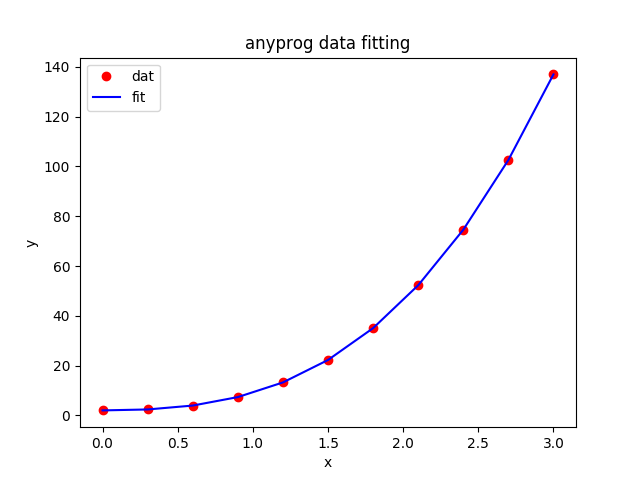

# anyprog
A C++ scientific library for mathematical programming and data fitting

# feature
- [anyprog](#anyprog)
- [feature](#feature)
  - [mathematical programming](#mathematical-programming)
    - [nonlinear-unconstrained-optimization](#nonlinear-unconstrained-optimization)
      - [example-1](#example-1)
      - [example-2](#example-2)
      - [example-3](#example-3)
    - [nonlinear-constrained-optimization](#nonlinear-constrained-optimization)
      - [example-1](#example-1-1)
      - [example-2](#example-2-1)
      - [example-3](#example-3-1)
    - [linear-optimization](#linear-optimization)
    - [quadratic-optimazition](#quadratic-optimazition)
    - [mixed-integer-optimazition](#mixed-integer-optimazition)
    - [any-optimazition](#any-optimazition)
      - [example-1](#example-1-2)
      - [example-2](#example-2-2)
  - [data fitting](#data-fitting)
    - [polynomial-fitting](#polynomial-fitting)
    - [nonlinear-fitting](#nonlinear-fitting)
  


## mathematical programming

### nonlinear-unconstrained-optimization
#### example-1
```cpp
#include <anyprog/anyprog.hpp>
#include <chrono>
#include <fstream>
#include <iostream>

int main(int argc, char** argv)
{
    auto output = [](const anyprog::real_block& ret, const anyprog::optimization::funcation_t& obj) {
        std::cout << "solution:\n";
        for (size_t i = 0; i < ret.rows(); ++i) {
            std::cout << "x(" << i << ")=\t" << ret(i, 0) << "\n";
        }
        std::cout << "object=\t" << obj(ret) << "\n\n";
    };

    anyprog::optimization::funcation_t obj = [](const anyprog::real_block& x) {
        return 100 * pow(x(1, 0) - pow(x(0, 0), 2), 2) + pow(1 - x(0, 0), 2);
    };

    std::vector<anyprog::optimization::range_t> range = { { -10, 10 }, { -10, 10 } };
    output(anyprog::optimization::fminbnd(obj, range, 1e-10), obj);

    anyprog::real_block param(2, 1);
    param(0, 0) = 0;
    param(1, 0) = 0;
    output(anyprog::optimization::fminunc(obj, param, 1e-10), obj);

    auto grad = [&](const anyprog::real_block& x) {
        anyprog::real_block ret(x.rows(), 1);
        ret(0, 0) = 2 * x(0) - 400 * x(0) * (x(1) - pow(x(0), 2)) - 2;
        ret(1, 0) = 200 * x(1) - 200 * pow(x(0), 2);
        return ret;
    };
    output(anyprog::optimization::fminunc(obj, grad, param), obj);

    return 0;
}

```
```txt
solution:
x(0)=	0.999986
x(1)=	0.999971
object=	2.16042e-10

solution:
x(0)=	1
x(1)=	1
object=	3.05615e-14

solution:
x(0)=	1
x(1)=	1
object=	3.56293e-17

```

#### example-2
```cpp
#include <anyprog/anyprog.hpp>
#include <chrono>
#include <fstream>
#include <iostream>

int main(int argc, char** argv)
{
    anyprog::optimization::funcation_t obj = [](const anyprog::real_block& x) {
        return 100 * pow(x(1, 0) - pow(x(0, 0), 2), 2) + pow(1 - x(0, 0), 2);
    };
    std::vector<anyprog::optimization::range_t> range = { { -10, 10 }, { -10, 10 } };
    anyprog::optimization opt(obj, range);
    auto ret = opt.search();

    std::cout << "global solution:\n";
    for (size_t i = 0; i < ret.rows(); ++i) {
        std::cout << "x(" << i << ")=\t" << ret(i, 0) << "\n";
    }
    std::cout << "object=\t" << opt.obj(ret) << "\n\n";

    auto history = opt.get_history();
    std::cout << "search history:\n";
    for (auto& iter : history) {
        for (size_t i = 0; i < iter.second.rows(); ++i) {
            std::cout << "x(" << i << ")=\t" << iter.second(i, 0) << "\n";
        }
        std::cout << "object=\t" << iter.first << "\n\n";
    }

    return 0;
}
```
```txt
global solution:
x(0)=	1.0025
x(1)=	1.00506
object=	6.45722e-06

search history:
x(0)=	0.845278
x(1)=	0.713799
object=	0.0239873

x(0)=	1.09488
x(1)=	1.19905
object=	0.00901008

x(0)=	1.05482
x(1)=	1.11285
object=	0.00300943

x(0)=	0.963414
x(1)=	0.928027
object=	0.00134049

x(0)=	1.02463
x(1)=	1.05004
object=	0.000609679

x(0)=	1.02144
x(1)=	1.04345
object=	0.000460868

x(0)=	1.0025
x(1)=	1.00506
object=	6.45722e-06

```
#### example-3
```cpp
#include <anyprog/anyprog.hpp>
#include <chrono>
#include <fstream>
#include <iostream>

int main(int argc, char** argv)
{
    anyprog::optimization::funcation_t obj = [](const anyprog::real_block& x) {
        return x(0, 0) * sin(x(0, 0)) * cos(2.0 * x(0, 0)) - 2.0 * x(0, 0) * sin(3.0 * x(0, 0));
    };

    std::vector<anyprog::optimization::range_t> range = { { 0, 20 } };

    anyprog::optimization opt(obj, range);
    auto ret = opt.search(100, 10);

    std::cout << "global solution:\n";
    for (size_t i = 0; i < ret.rows(); ++i) {
        std::cout << "x(" << i << ")=\t" << ret(i, 0) << "\n";
    }
    std::cout << "object=\t" << opt.obj(ret) << "\n\n";

    auto history = opt.get_history();
    std::cout << "search history:\n";
    for (auto& iter : history) {
        for (size_t i = 0; i < iter.second.rows(); ++i) {
            std::cout << "x(" << i << ")=\t" << iter.second(i, 0) << "\n";
        }
        std::cout << "object=\t" << iter.first << "\n\n";
    }

    return 0;
}
```

```txt
global solution:
x(0)=	19.4114
object=	-34.0963

search history:
x(0)=	15.1613
object=	-26.6283

x(0)=	19.4114
object=	-34.0963
```

### nonlinear-constrained-optimization
#### example-1
```cpp
#include <anyprog/anyprog.hpp>
#include <chrono>
#include <fstream>
#include <iostream>

int main(int argc, char** argv)
{
    anyprog::optimization::funcation_t obj = [](const anyprog::real_block& x) {
        return -log(x(0)) - log(x(1));
    };

    std::vector<anyprog::optimization::inequation_condition_funcation_t> ineq;
    ineq.emplace_back([&](const anyprog::real_block& x) {
        return x(0) - x(1);
    });

    std::vector<anyprog::optimization::equation_condition_funcation_t> eq;
    eq.emplace_back([&](const anyprog::real_block& x) {
        return x(0) + 2 * x(1) - 5;
    });

    std::vector<anyprog::optimization::range_t> range = { { 0, 10 }, { 0, 10 } };

    anyprog::optimization opt(obj, range);
    opt.set_inequation_condition(ineq);
    opt.set_equation_condition(eq);
    auto ret = opt.solve();

    std::cout << "solution:\n";
    for (size_t i = 0; i < ret.rows(); ++i) {
        std::cout << "x(" << i << ")=\t" << ret(i, 0) << "\n";
    }
    std::cout << "object=\t" << opt.obj(ret) << "\n";

    return 0;
}
```
```txt
solution:
x(0)=	1.66667
x(1)=	1.66667
object=	-1.02165

```
#### example-2
```cpp
#include <anyprog/anyprog.hpp>
#include <chrono>
#include <fstream>
#include <iostream>

int main(int argc, char** argv)
{
    anyprog::optimization::funcation_t obj = [](const anyprog::real_block& x) {
        return pow(1 - x(0), 2) + 100 * pow(x(1) - pow(x(0), 2), 2);
    };

    std::vector<anyprog::optimization::inequation_condition_funcation_t> ineq;
    ineq.emplace_back([&](const anyprog::real_block& x) {
        return pow(x(0) - 1. / 3., 2) + pow(x(1) - 1. / 3., 2) - pow(1. / 3., 2);
    });

    ineq.emplace_back([&](const anyprog::real_block& x) {
        return x(0) + x(1) - 2;
    });

    ineq.emplace_back([&](const anyprog::real_block& x) {
        return x(0) - 2 * x(1) - 3;
    });

    std::vector<anyprog::optimization::range_t> range = { { 0, 0.5 }, { 0.2, 0.8 } };

    anyprog::optimization opt(obj, range);
    opt.set_inequation_condition(ineq);
    auto ret = opt.solve();

    std::cout << "solution:\n";
    for (size_t i = 0; i < ret.rows(); ++i) {
        std::cout << "x(" << i << ")=\t" << ret(i, 0) << "\n";
    }
    std::cout << "object=\t" << opt.obj(ret) << "\n";
    return 0;
}
```
```txt
solution:
x(0)=	0.5
x(1)=	0.250026
object=	0.25

```
#### example-3
```cpp
#include <anyprog/anyprog.hpp>
#include <chrono>
#include <fstream>
#include <iostream>

int main(int argc, char** argv)
{
    size_t dim = 6;
    anyprog::optimization::funcation_t obj = [&](const anyprog::real_block& x) {
        return sqrt(pow(x(0) - x(1), 2) + pow(x(3) - x(4), 2)) + sqrt(pow(x(0) - x(2), 2) + pow(x(3) - x(5), 2)) + sqrt(pow(x(2) - x(1), 2) + pow(x(5) - x(4), 2));
    };
    std::vector<anyprog::optimization::inequation_condition_funcation_t> ineq;
    ineq.emplace_back([&](const anyprog::real_block& x) {
        return pow(x(0) - 5, 2) + pow(x(3) - 4, 2) - 4;
    });
    ineq.emplace_back([&](const anyprog::real_block& x) {
        return pow(x(1) + 5, 2) + pow(x(4) + 3, 2) - 1;
    });
    ineq.emplace_back([&](const anyprog::real_block& x) {
        return pow(x(2) + 1, 2) + pow(x(5) - 1, 2) - 1;
    });

    std::vector<anyprog::optimization::range_t> range;
    for (size_t i = 0; i < dim; ++i) {
        range.push_back({ -100, 100 });
    }
    anyprog::optimization opt(obj, range);
    opt.set_inequation_condition(ineq);
    auto ret = opt.search(100, 10);

    std::cout << "global solution:\n";
    for (size_t i = 0; i < ret.rows(); ++i) {
        std::cout << "x(" << i << ")=\t" << ret(i, 0) << "\n";
    }
    std::cout << "object=\t" << opt.obj(ret) << "\n\n";

    auto history = opt.get_history();
    std::cout << "search history:\n";
    for (auto& iter : history) {
        for (size_t i = 0; i < iter.second.rows(); ++i) {
            std::cout << "x(" << i << ")=\t" << iter.second(i, 0) << "\n";
        }
        std::cout << "object=\t" << iter.first << "\n\n";
    }

    return 0;
}
```
```txt
global solution:
x(0)=	3.35966
x(1)=	-4.18107
x(2)=	-0.310501
x(3)=	2.85576
x(4)=	-2.4261
x(5)=	0.286241
object=	18.4131

search history:
x(0)=	3.36641
x(1)=	-4.18061
x(2)=	-0.441214
x(3)=	2.84614
x(4)=	-2.42676
x(5)=	0.184949
object=	18.4132

x(0)=	3.36015
x(1)=	-4.18141
x(2)=	-0.244818
x(3)=	2.85507
x(4)=	-2.42562
x(5)=	0.344485
object=	18.4131

x(0)=	3.35966
x(1)=	-4.18107
x(2)=	-0.310501
x(3)=	2.85576
x(4)=	-2.4261
x(5)=	0.286241
object=	18.4131

```

### linear-optimization
```cpp
#include <anyprog/anyprog.hpp>
#include <chrono>
#include <fstream>
#include <iostream>

int main(int argc, char** argv)
{
    anyprog::real_block obj(3, 1);
    obj << -5, -4, -6;

    anyprog::real_block A(3, 3), b(3, 1);
    A << 1, -1, 1, 3, 2, 4, 3, 2, 0;
    b << 20, 42, 30;

    std::vector<anyprog::optimization::range_t> range = { { 0, 20 }, { 0, 20 }, { 0, 20 } };

    anyprog::optimization opt(obj, range);
    opt.set_inequation_condition(A, b);
    anyprog::real_block ret = opt.solve();

    std::cout << "solution:\n";
    for (size_t i = 0; i < ret.rows(); ++i) {
        std::cout << "x(" << i << ")=\t" << ret(i, 0) << "\n";
    }
    std::cout << "object=\t" << opt.obj(ret) << "\n";

    return 0;
}
```
```txt
solution:
x(0)=	3.9968e-15
x(1)=	15
x(2)=	3
object=	-78
```

### quadratic-optimazition
```cpp
#include <anyprog/anyprog.hpp>
#include <chrono>
#include <fstream>
#include <iostream>

int main(int argc, char** argv)
{
    anyprog::real_block h(2, 2);
    h << 2, -1, -1, 4;
    anyprog::real_block c(1, 2);
    c << -1, -10;

    anyprog::optimization::funcation_t obj = [&](const anyprog::real_block& x) {
        anyprog::real_block ret = 0.5 * (x.transpose() * h * x) + c * x;
        return ret(0, 0);
    };

    anyprog::real_block A(1, 2);
    A << 3, 2;
    anyprog::real_block b(1, 1);
    b << 6;

    std::vector<anyprog::optimization::range_t> range = { { 0, 10 }, { 0, 10 } };

    anyprog::optimization opt(obj, range);
    opt.set_inequation_condition(A, b);

    auto ret = opt.solve();

    std::cout << "solution:\n";
    for (size_t i = 0; i < ret.rows(); ++i) {
        std::cout << "x(" << i << ")=\t" << ret(i, 0) << "\n";
    }
    std::cout << "object=\t" << opt.obj(ret) << "\n";
    return 0;
}
```
```txt
solution:
x(0)=	0.499887
x(1)=	2.25017
object=	-13.75

```

### mixed-integer-optimazition
```cpp
#include <anyprog/anyprog.hpp>
#include <chrono>
#include <fstream>
#include <iostream>

int main(int argc, char** argv)
{
    size_t dim = 4;
    anyprog::real_block obj(dim, 1);
    obj << 3, 7, -1, 1;

    anyprog::real_block A(3, dim);
    A << -2, 1, -1, 1, -1, 1, -6, -4, -5, -3, 0, -1;

    anyprog::real_block b(3, 1);
    b << -1, -6, -5;

    std::vector<anyprog::optimization::range_t> range;
    for (size_t i = 0; i < dim; ++i) {
        range.push_back({ 0, 1 });
    }

    anyprog::optimization opt(obj, range);
    opt.set_inequation_condition(A, b)
        .set_enable_binary_filter();

    auto ret = opt.search(100, 10);

    std::cout << "global solution:\n";
    for (size_t i = 0; i < ret.rows(); ++i) {
        std::cout << "x(" << i << ")=\t" << ret(i, 0) << "\n";
    }
    std::cout << "object=\t" << opt.obj(ret) << "\n\n";

    auto history = opt.get_history();
    std::cout << "search history:\n";
    for (auto& iter : history) {
        for (size_t i = 0; i < iter.second.rows(); ++i) {
            std::cout << "x(" << i << ")=\t" << iter.second(i, 0) << "\n";
        }
        std::cout << "object=\t" << iter.first << "\n\n";
    }

    return 0;
}
```
```txt
global solution:
x(0)=	1
x(1)=	0
x(2)=	1
x(3)=	0
object=	2

search history:
x(0)=	1
x(1)=	1
x(2)=	1
x(3)=	0
object=	9

x(0)=	1
x(1)=	0
x(2)=	1
x(3)=	1
object=	3

x(0)=	1
x(1)=	0
x(2)=	1
x(3)=	0
object=	2

```

### any-optimazition
#### example-1
```cpp
#include <anyprog/anyprog.hpp>
#include <chrono>
#include <fstream>
#include <iostream>

int main(int argc, char** argv)
{
    anyprog::optimization::funcation_t obj = [](const anyprog::real_block& x) {
        return x(0) * x(3) * (x(0) + x(1) + x(2)) + x(2);
    };

    std::vector<anyprog::optimization::equation_condition_funcation_t> eq;
    eq.emplace_back([](const anyprog::real_block& x) {
        double sum = 0;
        for (size_t i = 0; i < 4; ++i) {
            sum += pow(x(i), 2);
        }
        return sum - 40;
    });

    std::vector<anyprog::optimization::inequation_condition_funcation_t> ineq;
    ineq.emplace_back([](const anyprog::real_block& x) {
        return 25 - x(0) * x(1) * x(2) * x(3);
    });

    std::vector<anyprog::optimization::range_t> range = { { 1, 5 }, { 1, 5 }, { 1, 5 }, { 1, 5 } };

    anyprog::optimization opt(obj, range);

    opt.set_equation_condition(eq)
        .set_inequation_condition(ineq)
        .set_filter_function([](anyprog::real_block& x) {
            x(0, 0) = round(x(0, 0));
        });

    auto ret = opt.search();
    std::cout << "global solution:\n";
    for (size_t i = 0; i < ret.rows(); ++i) {
        std::cout << "x(" << i << ")=\t" << ret(i, 0) << "\n";
    }
    std::cout << "object=\t" << opt.obj(ret) << "\n\n";

    auto history = opt.get_history();
    std::cout << "search history:\n";
    for (auto& iter : history) {
        for (size_t i = 0; i < iter.second.rows(); ++i) {
            std::cout << "x(" << i << ")=\t" << iter.second(i, 0) << "\n";
        }
        std::cout << "object=\t" << iter.first << "\n\n";
    }

    return 0;
}
```
```txt
global solution:
x(0)=	1
x(1)=	4.74309
x(2)=	3.82103
x(3)=	1.37942
object=	17.014

search history:
x(0)=	3
x(1)=	5
x(2)=	2.23607
x(3)=	1
object=	32.9443

x(0)=	2
x(1)=	3.16228
x(2)=	5
x(3)=	1
object=	25.3246

x(0)=	1
x(1)=	4.74309
x(2)=	3.82103
x(3)=	1.37942
object=	17.014
```
#### example-2
```cpp
#include <anyprog/anyprog.hpp>
#include <chrono>
#include <fstream>
#include <iostream>

int main(int argc, char** argv)
{
    //https://uk.mathworks.com/help/optim/ug/mixed-integer-linear-programming-basics.html
    anyprog::real_block obj(8, 1);
    obj << 350 * 5, 330 * 3, 310 * 4, 280 * 6, 500, 450, 400, 100;
    anyprog::real_block Aeq(3, 8), beq(3, 1);
    Aeq << 5, 3, 4, 6, 1, 1, 1, 1,
        5 * 0.05, 3 * 0.04, 4 * 0.05, 6 * 0.03, 0.08, 0.07, 0.06, 0.03,
        5 * 0.03, 3 * 0.03, 4 * 0.04, 6 * 0.04, 0.06, 0.07, 0.08, 0.09;
    beq << 25, 1.25, 1.25;
    std::vector<anyprog::optimization::range_t> range = { { 0, 1 }, { 0, 1 }, { 0, 1 }, { 0, 1 }, { 0, 10 }, { 0, 10 }, { 0, 10 }, { 0, 10 } };
    anyprog::optimization opt(obj, range);
    opt.set_equation_condition(Aeq, beq);
    opt.set_filter_function([](anyprog::real_block& x) {
        x(0, 0) = round(x(0, 0));
        x(1, 0) = round(x(1, 0));
        x(2, 0) = round(x(2, 0));
        x(3, 0) = round(x(3, 0));
    });
    auto ret = opt.search();
    if (opt.is_ok()) {
        std::cout << "solution:\n"
                  << ret << "\n";
        std::cout << "object:\t" << ret.transpose() * obj << "\n";
    } else {
        std::cout << "Not found.\n";
    }

    return 0;
}
```
```txt
solution:
       1
       1
       0
       1
 7.13349
0.233014
0.133493
     3.5
object:	8495

```

## data fitting
plotting data with python3:
```python

import matplotlib.pyplot as plt
import numpy as np

x, y, fit = np.loadtxt('dat.csv',delimiter=',', unpack=True)
plt.plot(x, y, 'ro', label='dat')
plt.plot(x, fit, 'b-', label='fit')
plt.xlabel('x')
plt.ylabel('y')
plt.title('anyprog data fitting')
plt.legend()
plt.show()
```
### polynomial-fitting

```cpp
#include <anyprog/anyprog.hpp>
#include <chrono>
#include <fstream>
#include <iostream>

int main(int argc, char** argv)
{
    anyprog::real_block x(11, 1), y(11, 1);
    x << 0, 0.3000, 0.6000, 0.9000, 1.2000, 1.5000, 1.8000, 2.1000, 2.4000, 2.7000, 3.0000;
    y << 2.0000, 2.3780, 3.9440, 7.3460, 13.2320, 22.2500, 35.0480, 52.2740, 74.5760, 102.6020, 137.0000;
    anyprog::fit fit(x, 3);
    auto ret = fit.solve(y), fitting = fit.fitting(ret);
    std::cout << ret << std::endl;
    std::ofstream out("dat.csv", std::ios::trunc | std::ios::ate);
    for (size_t i = 0; i < x.rows(); ++i) {
        out << x(i) << "," << y(i) << "," << fitting(i) << "\n";
    }
    return 0;
}
```
```txt
           4
           3
-1.06581e-14
           2
```



### nonlinear-fitting
```cpp
#include <anyprog/anyprog.hpp>
#include <chrono>
#include <fstream>
#include <iostream>

int main(int argc, char** argv)
{
    anyprog::real_block x(18, 1), y(18, 1);
    x << 0, 0.4, 1.2, 2, 2.8, 3.6, 4.4, 5.2, 6, 7.2, 8, 9.2, 10.4, 11.6, 12.4, 13.6, 14.4, 15;
    y << 1, 0.85, 0.29, -0.27, -0.53, -0.4, -0.12, 0.17, 0.28, 0.15, -0.03, -0.15, -0.071, 0.059, 0.08, 0.032, -0.015, -0.02;
    anyprog::real_block param(3, 1);
    param(0, 0) = 1;
    param(1, 0) = 1;
    param(2, 0) = -0.1;
    std::vector<anyprog::fit::funcation_t> fun;
    fun.emplace_back([](const anyprog::real_block& x, const anyprog::real_block& p) {
        return (cos(p(1, 0) * x(0, 0)) * pow(M_E, p(2, 0) * x(0, 0))) / p(0, 0);
    });
    anyprog::fit fit(x, fun, param);
    auto ret = fit.lssolve(y), fitting = fit.fitting(ret);
    std::cout << ret << std::endl;
    std::ofstream out("dat.csv", std::ios::trunc | std::ios::ate);
    for (size_t i = 0; i < x.rows(); ++i) {
        out << x(i) << "," << y(i) << "," << fitting(i) << "\n";
    }
    return 0;
}
```
```txt
   0.9375
  1.00111
-0.207208
```

