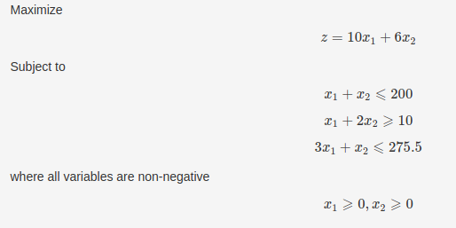
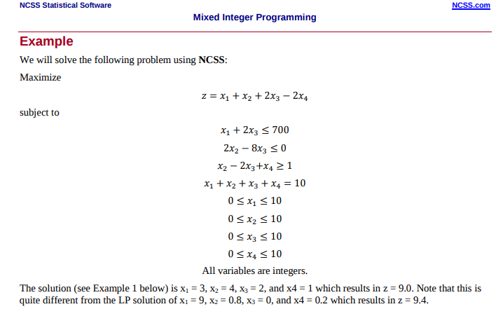
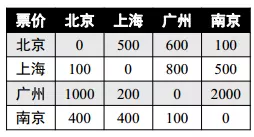

# anyprog
A C++ scientific library for mathematical programming,data fitting and solving nonlinear equations
```txt
                             min      f(x)
                           x in R^n
                           
                           s.t.       g(x) <= 0
                                      h(x)  = 0
                                lb <=   x  <= ub
```
# feature
- [anyprog](#anyprog)
- [feature](#feature)
- [usage](#usage)
  - [mathematical programming](#mathematical-programming)
    - [nonlinear-unconstrained-optimization](#nonlinear-unconstrained-optimization)
      - [example-1](#example-1)
      - [example-2](#example-2)
      - [example-3](#example-3)
    - [nonlinear-constrained-optimization](#nonlinear-constrained-optimization)
      - [example-1](#example-1-1)
      - [example-2](#example-2-1)
      - [example-3](#example-3-1)
      - [example-4](#example-4)
      - [example-5](#example-5)
    - [linear-optimization](#linear-optimization)
      - [example-1](#example-1-2)
      - [example-2](#example-2-2)
    - [quadratic-optimazition](#quadratic-optimazition)
    - [mixed-integer-optimazition](#mixed-integer-optimazition)
      - [example-1](#example-1-3)
      - [example-2](#example-2-3)
      - [example-3](#example-3-2)
      - [example-4](#example-4-1)
      - [example-5](#example-5-1)
    - [any-optimazition](#any-optimazition)
      - [example-1](#example-1-4)
      - [example-2](#example-2-4)
      - [example-3](#example-3-3)
      - [example-4](#example-4-2)
      - [example-5](#example-5-2)
  - [data fitting](#data-fitting)
    - [polynomial-fitting](#polynomial-fitting)
    - [nonlinear-fitting](#nonlinear-fitting)
  - [solving nonlinear equations](#solving-nonlinear-equations)
    - [example-1](#example-1-5)
    - [example-2](#example-2-5)


# usage
`pkg-config --libs --cflags anyprog`

## mathematical programming

### nonlinear-unconstrained-optimization
#### example-1
```cpp
#include <anyprog/anyprog.hpp>
#include <chrono>
#include <fstream>
#include <iostream>

int main(int argc, char** argv)
{
    auto output = [](const anyprog::real_block& ret, const anyprog::optimization::function_t& obj) {
        std::cout << "solution:\n";
        for (size_t i = 0; i < ret.rows(); ++i) {
            std::cout << "x(" << i << ")=\t" << ret(i, 0) << "\n";
        }
        std::cout << "object=\t" << obj(ret) << "\n\n";
    };

    anyprog::optimization::function_t obj = [](const anyprog::real_block& x) {
        return 100 * pow(x(1, 0) - pow(x(0, 0), 2), 2) + pow(1 - x(0, 0), 2);
    };

    std::vector<anyprog::optimization::range_t> range = { { -10, 10 }, { -10, 10 } };
    output(anyprog::optimization::fminbnd(obj, range, 1e-10), obj);

    anyprog::real_block param(2, 1);
    param(0, 0) = 0;
    param(1, 0) = 0;
    output(anyprog::optimization::fminunc(obj, param, 1e-10), obj);

    auto grad = [&](const anyprog::real_block& x) {
        anyprog::real_block ret(x.rows(), 1);
        ret(0, 0) = 2 * x(0) - 400 * x(0) * (x(1) - pow(x(0), 2)) - 2;
        ret(1, 0) = 200 * x(1) - 200 * pow(x(0), 2);
        return ret;
    };
    output(anyprog::optimization::fminunc(obj, grad, param), obj);

    return 0;
}

```
```txt
solution:
x(0)=	0.999986
x(1)=	0.999971
object=	2.16042e-10

solution:
x(0)=	1
x(1)=	1
object=	3.05615e-14

solution:
x(0)=	1
x(1)=	1
object=	3.56293e-17

```

#### example-2
```cpp
#include <anyprog/anyprog.hpp>
#include <chrono>
#include <fstream>
#include <iostream>

int main(int argc, char** argv)
{
    anyprog::optimization::function_t obj = [](const anyprog::real_block& x) {
        return 100 * pow(x(1, 0) - pow(x(0, 0), 2), 2) + pow(1 - x(0, 0), 2);
    };
    std::vector<anyprog::optimization::range_t> range = { { -10, 10 }, { -10, 10 } };
    anyprog::optimization opt(obj, range);
    auto ret = opt.search();

    std::cout << "global solution:\n";
    for (size_t i = 0; i < ret.rows(); ++i) {
        std::cout << "x(" << i << ")=\t" << ret(i, 0) << "\n";
    }
    std::cout << "object=\t" << opt.obj(ret) << "\n\n";

    auto history = opt.get_history();
    std::cout << "search history:\n";
    for (auto& iter : history) {
        for (size_t i = 0; i < iter.second.rows(); ++i) {
            std::cout << "x(" << i << ")=\t" << iter.second(i, 0) << "\n";
        }
        std::cout << "object=\t" << iter.first << "\n\n";
    }

    return 0;
}
```
```txt
global solution:
x(0)=	1.0025
x(1)=	1.00506
object=	6.45722e-06

search history:
x(0)=	0.845278
x(1)=	0.713799
object=	0.0239873

x(0)=	1.09488
x(1)=	1.19905
object=	0.00901008

x(0)=	1.05482
x(1)=	1.11285
object=	0.00300943

x(0)=	0.963414
x(1)=	0.928027
object=	0.00134049

x(0)=	1.02463
x(1)=	1.05004
object=	0.000609679

x(0)=	1.02144
x(1)=	1.04345
object=	0.000460868

x(0)=	1.0025
x(1)=	1.00506
object=	6.45722e-06

```
#### example-3
```cpp
#include <anyprog/anyprog.hpp>
#include <chrono>
#include <fstream>
#include <iostream>

int main(int argc, char** argv)
{
    anyprog::optimization::function_t obj = [](const anyprog::real_block& x) {
        return x(0, 0) * sin(x(0, 0)) * cos(2.0 * x(0, 0)) - 2.0 * x(0, 0) * sin(3.0 * x(0, 0));
    };

    std::vector<anyprog::optimization::range_t> range = { { 0, 20 } };

    anyprog::optimization opt(obj, range);
    auto ret = opt.search(100, 10);

    std::cout << "global solution:\n";
    for (size_t i = 0; i < ret.rows(); ++i) {
        std::cout << "x(" << i << ")=\t" << ret(i, 0) << "\n";
    }
    std::cout << "object=\t" << opt.obj(ret) << "\n\n";

    auto history = opt.get_history();
    std::cout << "search history:\n";
    for (auto& iter : history) {
        for (size_t i = 0; i < iter.second.rows(); ++i) {
            std::cout << "x(" << i << ")=\t" << iter.second(i, 0) << "\n";
        }
        std::cout << "object=\t" << iter.first << "\n\n";
    }

    return 0;
}
```

```txt
global solution:
x(0)=	19.4114
object=	-34.0963

search history:
x(0)=	15.1613
object=	-26.6283

x(0)=	19.4114
object=	-34.0963
```

### nonlinear-constrained-optimization
#### example-1
```cpp
#include <anyprog/anyprog.hpp>
#include <chrono>
#include <fstream>
#include <iostream>

int main(int argc, char** argv)
{
    anyprog::optimization::function_t obj = [](const anyprog::real_block& x) {
        return -log(x(0)) - log(x(1));
    };

    std::vector<anyprog::optimization::inequation_condition_function_t> ineq;
    ineq.emplace_back([&](const anyprog::real_block& x) {
        return x(0) - x(1);
    });

    std::vector<anyprog::optimization::equation_condition_function_t> eq;
    eq.emplace_back([&](const anyprog::real_block& x) {
        return x(0) + 2 * x(1) - 5;
    });

    std::vector<anyprog::optimization::range_t> range = { { 0, 10 }, { 0, 10 } };

    anyprog::optimization opt(obj, range);
    opt.set_inequation_condition(ineq);
    opt.set_equation_condition(eq);
    auto ret = opt.solve();

    std::cout << "solution:\n";
    for (size_t i = 0; i < ret.rows(); ++i) {
        std::cout << "x(" << i << ")=\t" << ret(i, 0) << "\n";
    }
    std::cout << "object=\t" << opt.obj(ret) << "\n";

    return 0;
}
```
```txt
solution:
x(0)=	1.66667
x(1)=	1.66667
object=	-1.02165

```
#### example-2
```cpp
#include <anyprog/anyprog.hpp>
#include <chrono>
#include <fstream>
#include <iostream>

int main(int argc, char** argv)
{
    anyprog::optimization::function_t obj = [](const anyprog::real_block& x) {
        return pow(1 - x(0), 2) + 100 * pow(x(1) - pow(x(0), 2), 2);
    };

    std::vector<anyprog::optimization::inequation_condition_function_t> ineq;
    ineq.emplace_back([&](const anyprog::real_block& x) {
        return pow(x(0) - 1. / 3., 2) + pow(x(1) - 1. / 3., 2) - pow(1. / 3., 2);
    });

    ineq.emplace_back([&](const anyprog::real_block& x) {
        return x(0) + x(1) - 2;
    });

    ineq.emplace_back([&](const anyprog::real_block& x) {
        return x(0) - 2 * x(1) - 3;
    });

    std::vector<anyprog::optimization::range_t> range = { { 0, 0.5 }, { 0.2, 0.8 } };

    anyprog::optimization opt(obj, range);
    opt.set_inequation_condition(ineq);
    auto ret = opt.solve();

    std::cout << "solution:\n";
    for (size_t i = 0; i < ret.rows(); ++i) {
        std::cout << "x(" << i << ")=\t" << ret(i, 0) << "\n";
    }
    std::cout << "object=\t" << opt.obj(ret) << "\n";
    return 0;
}
```
```txt
solution:
x(0)=	0.5
x(1)=	0.250026
object=	0.25

```
#### example-3
```cpp
#include <anyprog/anyprog.hpp>
#include <chrono>
#include <fstream>
#include <iostream>

int main(int argc, char** argv)
{
    size_t dim = 6;
    anyprog::optimization::function_t obj = [&](const anyprog::real_block& x) {
        return sqrt(pow(x(0) - x(1), 2) + pow(x(3) - x(4), 2)) + sqrt(pow(x(0) - x(2), 2) + pow(x(3) - x(5), 2)) + sqrt(pow(x(2) - x(1), 2) + pow(x(5) - x(4), 2));
    };
    std::vector<anyprog::optimization::inequation_condition_function_t> ineq;
    ineq.emplace_back([&](const anyprog::real_block& x) {
        return pow(x(0) - 5, 2) + pow(x(3) - 4, 2) - 4;
    });
    ineq.emplace_back([&](const anyprog::real_block& x) {
        return pow(x(1) + 5, 2) + pow(x(4) + 3, 2) - 1;
    });
    ineq.emplace_back([&](const anyprog::real_block& x) {
        return pow(x(2) + 1, 2) + pow(x(5) - 1, 2) - 1;
    });

    std::vector<anyprog::optimization::range_t> range;
    for (size_t i = 0; i < dim; ++i) {
        range.push_back({ -100, 100 });
    }
    anyprog::optimization opt(obj, range);
    opt.set_inequation_condition(ineq);
    auto ret = opt.search(100, 10);

    std::cout << "global solution:\n";
    for (size_t i = 0; i < ret.rows(); ++i) {
        std::cout << "x(" << i << ")=\t" << ret(i, 0) << "\n";
    }
    std::cout << "object=\t" << opt.obj(ret) << "\n\n";

    auto history = opt.get_history();
    std::cout << "search history:\n";
    for (auto& iter : history) {
        for (size_t i = 0; i < iter.second.rows(); ++i) {
            std::cout << "x(" << i << ")=\t" << iter.second(i, 0) << "\n";
        }
        std::cout << "object=\t" << iter.first << "\n\n";
    }

    return 0;
}
```
```txt
global solution:
x(0)=	3.35966
x(1)=	-4.18107
x(2)=	-0.310501
x(3)=	2.85576
x(4)=	-2.4261
x(5)=	0.286241
object=	18.4131

search history:
x(0)=	3.36641
x(1)=	-4.18061
x(2)=	-0.441214
x(3)=	2.84614
x(4)=	-2.42676
x(5)=	0.184949
object=	18.4132

x(0)=	3.36015
x(1)=	-4.18141
x(2)=	-0.244818
x(3)=	2.85507
x(4)=	-2.42562
x(5)=	0.344485
object=	18.4131

x(0)=	3.35966
x(1)=	-4.18107
x(2)=	-0.310501
x(3)=	2.85576
x(4)=	-2.4261
x(5)=	0.286241
object=	18.4131

```
#### example-4
```cpp
#include <anyprog/anyprog.hpp>
#include <chrono>
#include <fstream>
#include <iostream>

int main(int argc, char** argv)
{
    //https://www.coin-or.org/Ipopt/documentation/node20.html
    anyprog::optimization::function_t obj = [](const anyprog::real_block& x) {
        return x(0) * x(3) * (x(0) + x(1) + x(2)) + x(2);
    };
    std::vector<anyprog::optimization::inequation_condition_function_t> ineq;
    ineq.emplace_back([](const anyprog::real_block& x) {
        return 25 - x.prod();
    });
    std::vector<anyprog::optimization::equation_condition_function_t> eq;
    eq.emplace_back([](const anyprog::real_block& x) {
        size_t dim = x.rows();
        double sum = 0;
        for (size_t i = 0; i < dim; ++i) {
            sum += pow(x(i), 2);
        }
        return sum - 40;
    });
    std::vector<anyprog::optimization::range_t> range = { { 1, 5 }, { 1, 5 }, { 1, 5 }, { 1, 5 } };
    anyprog::real_block param(4, 1);
    param << 1, 5, 5, 1;
    anyprog::optimization opt(obj, param, range);
    opt.set_equation_condition(eq).set_inequation_condition(ineq);
    auto ret = opt.solve();
    if (opt.is_ok()) {
        std::cout << "solution:\n";
        for (size_t i = 0; i < ret.rows(); ++i) {
            std::cout << "x(" << i << ")=\t" << ret(i, 0) << "\n";
        }
        std::cout << "object:\t" << obj(ret) << "\n";
    } else {
        std::cout << "Not found.\n";
    }

    return 0;
}
```
```txt
solution:
x(0)=	1
x(1)=	4.74303
x(2)=	3.82112
x(3)=	1.37941
object:	17.014
```
#### example-5
```cpp
#include <anyprog/anyprog.hpp>
#include <chrono>
#include <fstream>
#include <iostream>

int main(int argc, char** argv)
{
    //https://minlp.com/downloads/examples/nlp2.bar
    anyprog::optimization::function_t obj = [](const anyprog::real_block& x) {
        return x(2);
    };
    std::vector<anyprog::optimization::equation_condition_function_t> eq = {
        [](const anyprog::real_block& x) {
            return 250 + 30 * x(0) - 6 * x(0) * x(0) - x(2);
        },
        [](const anyprog::real_block& x) {
            return 300 + 20 * x(1) - 12 * x(1) * x(1) - x(2);
        },
        [](const anyprog::real_block& x) {
            return 150 + 0.5 * (x(0) + x(1)) * (x(0) + x(1)) - x(2);
        }

    };
    std::vector<anyprog::optimization::range_t> range = { { 0, 9.422 }, { 0, 5.9023 }, { 0, 267.417085245 } };
    anyprog::optimization opt(obj, range);
    opt.set_equation_condition(eq);
    auto ret = opt.search();
    if (opt.is_ok()) {
        for (size_t i = 0; i < ret.rows(); ++i) {
            std::cout << "x(" << i << ")=\t" << ret(i, 0) << "\n";
        }
        std::cout << "object=\t" << obj(ret) << "\n\n";
    }

    return 0;
}
```
```txt
x(0)=	6.29343
x(1)=	3.82184
x(2)=	201.159
object=	201.159

```

### linear-optimization
#### example-1
```cpp
#include <anyprog/anyprog.hpp>
#include <chrono>
#include <fstream>
#include <iostream>

int main(int argc, char** argv)
{
    anyprog::real_block obj(3, 1);
    obj << -5, -4, -6;

    anyprog::real_block A(3, 3), b(3, 1);
    A << 1, -1, 1, 3, 2, 4, 3, 2, 0;
    b << 20, 42, 30;

    std::vector<anyprog::optimization::range_t> range = { { 0, 20 }, { 0, 20 }, { 0, 20 } };

    anyprog::optimization opt(obj, range);
    opt.set_inequation_condition(A, b);
    anyprog::real_block ret = opt.solve();

    std::cout << "solution:\n";
    for (size_t i = 0; i < ret.rows(); ++i) {
        std::cout << "x(" << i << ")=\t" << ret(i, 0) << "\n";
    }
    std::cout << "object=\t" << opt.obj(ret) << "\n";

    return 0;
}
```
```txt
solution:
x(0)=	3.9968e-15
x(1)=	15
x(2)=	3
object=	-78
```
#### example-2

```cpp
#include <anyprog/anyprog.hpp>
#include <chrono>
#include <fstream>
#include <iostream>

int main(int argc, char** argv)
{
    anyprog::real_block obj(2, 1), A(3, 2), b(3, 1);
    obj << -10, -6;
    A << 1, 1, -1, -2, 3, 1;
    b << 200, -10, 275.5;
    std::vector<anyprog::optimization::range_t> range = { { 0, 200 }, { 0, 200 } };
    anyprog::optimization opt(obj, range);
    opt.set_inequation_condition(A, b);
    auto ret = opt.search();
    if (opt.is_ok()) {
        std::cout << ret << "\n"
                  << obj.transpose() * ret << "\n";
    } else {
        std::cout << "Not Found\n";
    }
    return 0;
}
```
```txt
 37.75
162.25
-1351

```

### quadratic-optimazition
```cpp
#include <anyprog/anyprog.hpp>
#include <chrono>
#include <fstream>
#include <iostream>

int main(int argc, char** argv)
{
    anyprog::real_block h(2, 2);
    h << 2, -1, -1, 4;
    anyprog::real_block c(1, 2);
    c << -1, -10;

    anyprog::optimization::function_t obj = [&](const anyprog::real_block& x) {
        anyprog::real_block ret = 0.5 * (x.transpose() * h * x) + c * x;
        return ret(0, 0);
    };

    anyprog::real_block A(1, 2);
    A << 3, 2;
    anyprog::real_block b(1, 1);
    b << 6;

    std::vector<anyprog::optimization::range_t> range = { { 0, 10 }, { 0, 10 } };

    anyprog::optimization opt(obj, range);
    opt.set_inequation_condition(A, b);

    auto ret = opt.solve();

    std::cout << "solution:\n";
    for (size_t i = 0; i < ret.rows(); ++i) {
        std::cout << "x(" << i << ")=\t" << ret(i, 0) << "\n";
    }
    std::cout << "object=\t" << opt.obj(ret) << "\n";
    return 0;
}
```
```txt
solution:
x(0)=	0.499887
x(1)=	2.25017
object=	-13.75

```

### mixed-integer-optimazition
#### example-1
```cpp
#include <anyprog/anyprog.hpp>
#include <chrono>
#include <fstream>
#include <iostream>

int main(int argc, char** argv)
{
    size_t dim = 4;
    anyprog::real_block obj(dim, 1);
    obj << 3, 7, -1, 1;

    anyprog::real_block A(3, dim);
    A << -2, 1, -1, 1, -1, 1, -6, -4, -5, -3, 0, -1;

    anyprog::real_block b(3, 1);
    b << -1, -6, -5;

    std::vector<anyprog::optimization::range_t> range;
    for (size_t i = 0; i < dim; ++i) {
        range.push_back({ 0, 1 });
    }

    anyprog::optimization opt(obj, range);
    opt.set_inequation_condition(A, b)
        .set_enable_binary_filter();

    auto ret = opt.search(100, 10);

    std::cout << "global solution:\n";
    for (size_t i = 0; i < ret.rows(); ++i) {
        std::cout << "x(" << i << ")=\t" << ret(i, 0) << "\n";
    }
    std::cout << "object=\t" << opt.obj(ret) << "\n\n";

    auto history = opt.get_history();
    std::cout << "search history:\n";
    for (auto& iter : history) {
        for (size_t i = 0; i < iter.second.rows(); ++i) {
            std::cout << "x(" << i << ")=\t" << iter.second(i, 0) << "\n";
        }
        std::cout << "object=\t" << iter.first << "\n\n";
    }

    return 0;
}
```
```txt
global solution:
x(0)=	1
x(1)=	0
x(2)=	1
x(3)=	0
object=	2

search history:
x(0)=	1
x(1)=	1
x(2)=	1
x(3)=	0
object=	9

x(0)=	1
x(1)=	0
x(2)=	1
x(3)=	1
object=	3

x(0)=	1
x(1)=	0
x(2)=	1
x(3)=	0
object=	2

```
#### example-2
```cpp
#include <anyprog/anyprog.hpp>
#include <chrono>
#include <fstream>
#include <iostream>

int main(int argc, char** argv)
{
    anyprog::optimization::function_t obj = [](const anyprog::real_block& x) {
        return pow(x(0) - 1, 2) + pow(x(1) - 1, 2) + pow(x(2) - 1, 2) - log(1 + x(3)) + pow(x(4) - 1, 2) + pow(x(5) - 2, 2) + pow(x(6) - 3, 2);
    };
    std::vector<anyprog::optimization::inequation_condition_function_t> ineq;
    ineq.emplace_back([](const anyprog::real_block& x) {
        return x.sum() - x(3) - 5;
    });
    ineq.emplace_back([](const anyprog::real_block& x) {
        return pow(x(2), 2) + pow(x(4), 2) + pow(x(5), 2) + pow(x(6), 2) - 5.5;
    });
    ineq.emplace_back([](const anyprog::real_block& x) {
        return x(0) + x(4) - 1.2;
    });
    ineq.emplace_back([](const anyprog::real_block& x) {
        return x(1) + x(5) - 1.8;
    });
    ineq.emplace_back([](const anyprog::real_block& x) {
        return x(2) + x(6) - 2.5;
    });
    ineq.emplace_back([](const anyprog::real_block& x) {
        return x(3) + x(4) - 1.2;
    });
    ineq.emplace_back([](const anyprog::real_block& x) {
        return pow(x(1), 2) + pow(x(5), 2) - 1.64;
    });
    ineq.emplace_back([](const anyprog::real_block& x) {
        return pow(x(2), 2) + pow(x(6), 2) - 4.25;
    });
    ineq.emplace_back([](const anyprog::real_block& x) {
        return pow(x(1), 2) + pow(x(6), 2) - 4.64;
    });

    anyprog::real_block param(7, 1);
    param << 1, 1, 1, 1, 1, 1, 1;
    anyprog::optimization::enable_default_bound_step = true;
    anyprog::optimization opt(obj, param);
    opt.set_inequation_condition(ineq);
    opt.set_filter_function([](anyprog::real_block& x) {
        x(0, 0) = round(x(0, 0));
        x(1, 0) = round(x(1, 0));
        x(2, 0) = round(x(2, 0));
        x(3, 0) = round(x(3, 0));
    });
    auto ret = opt.search();
    if (opt.is_ok()) {
        std::cout << "golbal solution:\n";
        for (size_t i = 0; i < ret.rows(); ++i) {
            std::cout << "x(" << i << ")=\t" << ret(i, 0) << "\n";
        }
        std::cout << "object:\t" << obj(ret) << "\n";
    } else {
        std::cout << "Not found.\n";
    }

    return 0;
}
```
```txt
golbal solution:
x(0)=	1
x(1)=	0
x(2)=	0
x(3)=	1
x(4)=	0.2
x(5)=	1.28062
x(6)=	1.95448
object:	3.55746
```
#### example-3

```cpp
#include <anyprog/anyprog.hpp>
#include <chrono>
#include <fstream>
#include <iostream>

int main(int argc, char** argv)
{
    size_t dim = 4;
    anyprog::real_block obj(dim, 1);
    obj << -1, -1, -2, 2;
    anyprog::real_block Aeq(1, dim), beq(1, 1), A(3, dim), b(3, 1);
    Aeq << 1, 1, 1, 1;
    beq << 10;
    A << 1, 0, 2, 0, 0, 2, -8, 0, 0, -1, 2, -1;
    b << 700, 0, -1;

    std::vector<anyprog::optimization::range_t> range;
    for (size_t i = 0; i < dim; ++i) {
        range.push_back({ 0, 10 });
    }
    anyprog::optimization opt(obj, range);
    opt.set_equation_condition(Aeq, beq).set_inequation_condition(A, b);
    opt.set_enable_integer_filter();
    anyprog::real_block ret = opt.search();
    if (opt.is_ok()) {
        std::cout << "global solution:\n";
        for (size_t i = 0; i < ret.rows(); ++i) {
            std::cout << "x(" << i << ")=\t" << ret(i, 0) << "\n";
        }
        std::cout << "object:\t" << ret.transpose() * obj << "\n\n";

        auto history = opt.get_history();
        std::cout << "search history:\n";
        for (auto& iter : history) {
            for (size_t i = 0; i < iter.second.rows(); ++i) {
                std::cout << "x(" << i << ")=\t" << iter.second(i, 0) << "\n";
            }
            std::cout << "object=\t" << iter.first << "\n\n";
        }
    } else {
        std::cout << "Not found.\n";
    }

    return 0;
}
```
```txt
global solution:
x(0)=	0
x(1)=	7
x(2)=	3
x(3)=	0
object:	-13

search history:
x(0)=	4
x(1)=	3
x(2)=	1
x(3)=	2
object=	-5

x(0)=	0
x(1)=	6
x(2)=	3
x(3)=	1
object=	-10

x(0)=	5
x(1)=	4
x(2)=	1
x(3)=	0
object=	-11

x(0)=	3
x(1)=	5
x(2)=	2
x(3)=	0
object=	-12

x(0)=	0
x(1)=	7
x(2)=	3
x(3)=	0
object=	-13
```
#### example-4

```cpp
#include <anyprog/anyprog.hpp>
#include <chrono>
#include <fstream>
#include <iostream>

int main(int argc, char** argv)
{
    anyprog::real_block obj(2, 1), A(3, 2), b(3, 1);
    obj << -10, -6;
    A << 1, 1, -1, -2, 3, 1;
    b << 200, -10, 275.5;
    std::vector<anyprog::optimization::range_t> range = { { 0, 200 }, { 0, 200 } };
    anyprog::optimization opt(obj, range);
    opt.set_inequation_condition(A, b);
    opt.set_enable_integer_filter();
    auto ret = opt.search();
    if (opt.is_ok()) {
        std::cout << ret << "\n"
                  << obj.transpose() * ret << "\n";
    } else {
        std::cout << "Not Found\n";
    }
    return 0;
}
```
```txt
 37
163
-1348

```
#### example-5
```cpp
#include <anyprog/anyprog.hpp>
#include <chrono>
#include <fstream>
#include <iostream>

int main(int argc, char** argv)
{
    //https://minlp.com/downloads/examples/minlp.bar
    anyprog::optimization::function_t obj = [](const anyprog::real_block& x) {
        double x1 = x(0), x2 = x(1), x3 = x(2), y1 = x(3), y2 = x(4), y3 = x(5);
        return 5 * y1 + 6 * y2 + 8 * y3 + 10 * x1 - 7 * x3 - 18 * log(x2 + 1)
            - 19.2 * log(x1 - x2 + 1) + 10;
    };
    std::vector<anyprog::optimization::inequation_condition_function_t> ineq = {
        [](const anyprog::real_block& x) {
            double x1 = x(0), x2 = x(1), x3 = x(2);
            return -(0.8 * log(x2 + 1) + 0.96 * log(x1 - x2 + 1) - 0.8 * x3);
        },
        [](const anyprog::real_block& x) {
            double x1 = x(0), x2 = x(1), x3 = x(2), y3 = x(5);
            return -2 - (log(x2 + 1) + 1.2 * log(x1 - x2 + 1) - x3 - 2 * y3);
        },
        [](const anyprog::real_block& x) {
            double x1 = x(0), x2 = x(1);
            return x2 - x1;
        },
        [](const anyprog::real_block& x) {
            double x2 = x(1), y1 = x(3);
            return x2 - 2 * y1;
        },
        [](const anyprog::real_block& x) {
            double x1 = x(0), x2 = x(1), y2 = x(4);
            return x1 - x2 - 2 * y2;
        },
        [](const anyprog::real_block& x) {
            double y1 = x(3), y2 = x(4);
            return y1 + y2 - 1;
        }
    };
    std::vector<anyprog::optimization::range_t> range = {
        { 0, 2 }, { 0, 2 }, { 0, 1 }, { 0, 1 }, { 0, 1 }, { 0, 1 }
    };
    anyprog::optimization opt(obj, range);
    opt.set_inequation_condition(ineq);
    opt.set_filter_function([](anyprog::real_block& x) {
        x(3) = round(x(3));
        x(4) = round(x(4));
        x(5) = round(x(5));
    });
    auto ret = opt.search();
    if (opt.is_ok()) {
        for (size_t i = 0; i < ret.rows(); ++i) {
            std::cout << "x(" << i << ")=\t" << ret(i, 0) << "\n";
        }
        std::cout << "object=\t" << obj(ret) << "\n\n";
    }

    return 0;
}
```
```txt
x(0)=	1.30096
x(1)=	0
x(2)=	1
x(3)=	0
x(4)=	1
x(5)=	0
object=	6.00973

```

### any-optimazition
#### example-1
```cpp
#include <anyprog/anyprog.hpp>
#include <chrono>
#include <fstream>
#include <iostream>

int main(int argc, char** argv)
{
    anyprog::optimization::function_t obj = [](const anyprog::real_block& x) {
        return x(0) * x(3) * (x(0) + x(1) + x(2)) + x(2);
    };

    std::vector<anyprog::optimization::equation_condition_function_t> eq;
    eq.emplace_back([](const anyprog::real_block& x) {
        double sum = 0;
        for (size_t i = 0; i < 4; ++i) {
            sum += pow(x(i), 2);
        }
        return sum - 40;
    });

    std::vector<anyprog::optimization::inequation_condition_function_t> ineq;
    ineq.emplace_back([](const anyprog::real_block& x) {
        return 25 - x(0) * x(1) * x(2) * x(3);
    });

    std::vector<anyprog::optimization::range_t> range = { { 1, 5 }, { 1, 5 }, { 1, 5 }, { 1, 5 } };

    anyprog::optimization opt(obj, range);

    opt.set_equation_condition(eq)
        .set_inequation_condition(ineq)
        .set_filter_function([](anyprog::real_block& x) {
            x(0, 0) = round(x(0, 0));
        });

    auto ret = opt.search();
    std::cout << "global solution:\n";
    for (size_t i = 0; i < ret.rows(); ++i) {
        std::cout << "x(" << i << ")=\t" << ret(i, 0) << "\n";
    }
    std::cout << "object=\t" << opt.obj(ret) << "\n\n";

    auto history = opt.get_history();
    std::cout << "search history:\n";
    for (auto& iter : history) {
        for (size_t i = 0; i < iter.second.rows(); ++i) {
            std::cout << "x(" << i << ")=\t" << iter.second(i, 0) << "\n";
        }
        std::cout << "object=\t" << iter.first << "\n\n";
    }

    return 0;
}
```
```txt
global solution:
x(0)=	1
x(1)=	4.74309
x(2)=	3.82103
x(3)=	1.37942
object=	17.014

search history:
x(0)=	3
x(1)=	5
x(2)=	2.23607
x(3)=	1
object=	32.9443

x(0)=	2
x(1)=	3.16228
x(2)=	5
x(3)=	1
object=	25.3246

x(0)=	1
x(1)=	4.74309
x(2)=	3.82103
x(3)=	1.37942
object=	17.014
```
#### example-2
```cpp
#include <anyprog/anyprog.hpp>
#include <chrono>
#include <fstream>
#include <iostream>

int main(int argc, char** argv)
{
    //https://uk.mathworks.com/help/optim/ug/mixed-integer-linear-programming-basics.html
    anyprog::real_block obj(8, 1);
    obj << 350 * 5, 330 * 3, 310 * 4, 280 * 6, 500, 450, 400, 100;
    anyprog::real_block Aeq(3, 8), beq(3, 1);
    Aeq << 5, 3, 4, 6, 1, 1, 1, 1,
        5 * 0.05, 3 * 0.04, 4 * 0.05, 6 * 0.03, 0.08, 0.07, 0.06, 0.03,
        5 * 0.03, 3 * 0.03, 4 * 0.04, 6 * 0.04, 0.06, 0.07, 0.08, 0.09;
    beq << 25, 1.25, 1.25;
    std::vector<anyprog::optimization::range_t> range = { { 0, 1 }, { 0, 1 }, { 0, 1 }, { 0, 1 }, { 0, 10 }, { 0, 10 }, { 0, 10 }, { 0, 10 } };
    anyprog::optimization opt(obj, range);
    opt.set_equation_condition(Aeq, beq);
    opt.set_filter_function([](anyprog::real_block& x) {
        x(0, 0) = round(x(0, 0));
        x(1, 0) = round(x(1, 0));
        x(2, 0) = round(x(2, 0));
        x(3, 0) = round(x(3, 0));
    });
    auto ret = opt.search();
    if (opt.is_ok()) {
        std::cout << "solution:\n"
                  << ret << "\n";
        std::cout << "object:\t" << ret.transpose() * obj << "\n";
    } else {
        std::cout << "Not found.\n";
    }

    return 0;
}
```
```txt
solution:
       1
       1
       0
       1
 7.13349
0.233014
0.133493
     3.5
object:	8495

```
#### example-3
```cpp
#include <anyprog/anyprog.hpp>
#include <chrono>
#include <fstream>
#include <iostream>

int main(int argc, char** argv)
{
    //https://www.geeksforgeeks.org/job-assignment-problem-using-branch-and-bound/
    anyprog::real_block c(4, 4);
    c << 9, 2, 7, 8,
        6, 4, 3, 7,
        5, 8, 1, 8,
        7, 6, 9, 4;
    anyprog::optimization::assignment assignment(c);
    auto path = assignment.solve();
    anyprog::real_block s(4, 4);
    s.fill(0);
    for (auto& i : path) {
        s(i.first, i.second) = 1;
    }
    std::cout << assignment.obj() << "\n"
              << s << "\n";
    return 0;
}
```
```txt
13
0 1 0 0
1 0 0 0
0 0 1 0
0 0 0 1
```
#### example-4

```cpp
#include <anyprog/anyprog.hpp>
#include <chrono>
#include <fstream>
#include <iostream>


int main(int argc, char** argv)
{
    //Travelling Salesman Problem
    anyprog::real_block c(4, 4);
    c << 0, 500, 600, 100,
        100, 0, 800, 500,
        1000, 200, 0, 2000,
        400, 400, 100, 0;
    std::cout << c << "\n\n";
    anyprog::optimization::tsp tsp(c);
    auto path = tsp.solve();
    std::cout << "path=|";
    for (auto& i : path) {
        std::cout << i << "|";
    }
    std::cout << "\ndistance="
              << tsp.obj() << "\n";
    return 0;
}
```
```txt
   0  500  600  100
 100    0  800  500
1000  200    0 2000
 400  400  100    0

path=|0|3|2|1|0|
distance=500

```
#### example-5
```cpp
#include <anyprog/anyprog.hpp>
#include <chrono>
#include <fstream>
#include <iostream>

int main(int argc, char** argv)
{
    //https://people.sc.fsu.edu/~jburkardt/datasets/tsp/p01.tsp
    anyprog::real_block dis(15, 15);
    dis << 0, 29, 82, 46, 68, 52, 72, 42, 51, 55, 29, 74, 23, 72, 46,
        29, 0, 55, 46, 42, 43, 43, 23, 23, 31, 41, 51, 11, 52, 21,
        82, 55, 0, 68, 46, 55, 23, 43, 41, 29, 79, 21, 64, 31, 51,
        46, 46, 68, 0, 82, 15, 72, 31, 62, 42, 21, 51, 51, 43, 64,
        68, 42, 46, 82, 0, 74, 23, 52, 21, 46, 82, 58, 46, 65, 23,
        52, 43, 55, 15, 74, 0, 61, 23, 55, 31, 33, 37, 51, 29, 59,
        72, 43, 23, 72, 23, 61, 0, 42, 23, 31, 77, 37, 51, 46, 33,
        42, 23, 43, 31, 52, 23, 42, 0, 33, 15, 37, 33, 33, 31, 37,
        51, 23, 41, 62, 21, 55, 23, 33, 0, 29, 62, 46, 29, 51, 11,
        55, 31, 29, 42, 46, 31, 31, 15, 29, 0, 51, 21, 41, 23, 37,
        29, 41, 79, 21, 82, 33, 77, 37, 62, 51, 0, 65, 42, 59, 61,
        74, 51, 21, 51, 58, 37, 37, 33, 46, 21, 65, 0, 61, 11, 55,
        23, 11, 64, 51, 46, 51, 51, 33, 29, 41, 42, 61, 0, 62, 23,
        72, 52, 31, 43, 65, 29, 46, 31, 51, 23, 59, 11, 62, 0, 59,
        46, 21, 51, 64, 23, 59, 33, 37, 11, 37, 61, 55, 23, 59, 0;
    anyprog::optimization::tsp tsp(dis);
    auto path = tsp.solve();
    std::cout << "path=|";
    for (size_t i = 0; i < path.size(); ++i) {
        std::cout << path[i] << "|";
    }
    std::cout << "\ndistance="
              << tsp.obj() << "\n";
    return 0;
}
```
```txt
path=|0|12|1|14|8|4|6|2|11|13|9|7|5|3|10|0|
distance=291
```

## data fitting
plotting data with python3:
```python

import matplotlib.pyplot as plt
import numpy as np

x, y, fit = np.loadtxt('dat.csv',delimiter=',', unpack=True)
plt.plot(x, y, 'ro', label='dat')
plt.plot(x, fit, 'b-', label='fit')
plt.xlabel('x')
plt.ylabel('y')
plt.title('anyprog data fitting')
plt.legend()
plt.show()
```
### polynomial-fitting

```cpp
#include <anyprog/anyprog.hpp>
#include <chrono>
#include <fstream>
#include <iostream>

int main(int argc, char** argv)
{
    anyprog::real_block x(11, 1), y(11, 1);
    x << 0, 0.3000, 0.6000, 0.9000, 1.2000, 1.5000, 1.8000, 2.1000, 2.4000, 2.7000, 3.0000;
    y << 2.0000, 2.3780, 3.9440, 7.3460, 13.2320, 22.2500, 35.0480, 52.2740, 74.5760, 102.6020, 137.0000;
    anyprog::fit fit(x, 3);
    auto ret = fit.solve(y), fitting = fit.fitting(ret);
    std::cout << ret << std::endl;
    std::ofstream out("dat.csv", std::ios::trunc | std::ios::ate);
    for (size_t i = 0; i < x.rows(); ++i) {
        out << x(i) << "," << y(i) << "," << fitting(i) << "\n";
    }
    return 0;
}
```
```txt
           4
           3
-1.06581e-14
           2
```


### nonlinear-fitting
```cpp
#include <anyprog/anyprog.hpp>
#include <chrono>
#include <fstream>
#include <iostream>

int main(int argc, char** argv)
{
    anyprog::real_block x(18, 1), y(18, 1);
    x << 0, 0.4, 1.2, 2, 2.8, 3.6, 4.4, 5.2, 6, 7.2, 8, 9.2, 10.4, 11.6, 12.4, 13.6, 14.4, 15;
    y << 1, 0.85, 0.29, -0.27, -0.53, -0.4, -0.12, 0.17, 0.28, 0.15, -0.03, -0.15, -0.071, 0.059, 0.08, 0.032, -0.015, -0.02;
    anyprog::real_block param(3, 1);
    param(0, 0) = 1;
    param(1, 0) = 1;
    param(2, 0) = -0.1;
    std::vector<anyprog::fit::function_t> fun;
    fun.emplace_back([](const anyprog::real_block& x, const anyprog::real_block& p) {
        return (cos(p(1, 0) * x(0, 0)) * pow(M_E, p(2, 0) * x(0, 0))) / p(0, 0);
    });
    anyprog::fit fit(x, fun, param);
    auto ret = fit.lssolve(y), fitting = fit.fitting(ret);
    std::cout << ret << std::endl;
    std::ofstream out("dat.csv", std::ios::trunc | std::ios::ate);
    for (size_t i = 0; i < x.rows(); ++i) {
        out << x(i) << "," << y(i) << "," << fitting(i) << "\n";
    }
    return 0;
}
```
```txt
   0.9375
  1.00111
-0.207208
```


## solving nonlinear equations
### example-1
```cpp
#include <anyprog/anyprog.hpp>
#include <chrono>
#include <fstream>
#include <iostream>

int main(int argc, char** argv)
{
    std::vector<anyprog::equation::function_t> eq;
    eq.emplace_back([](const anyprog::real_block& x){
        return exp(-exp(x(0)+x(1)))-x(1)*(1+x(0)*x(0));
    });
    eq.emplace_back([](const anyprog::real_block&x){
        return x(0)*cos(x(1))+x(1)*sin(x(0))-0.5;
    });
    anyprog::real_block param(2,1);
    param<<0,0;
    anyprog::equation solver(eq,param);
    auto ret = solver.solve();
    if (solver.is_ok()) {
        std::cout << "solution:\n";
        for (size_t i = 0; i < ret.rows(); ++i) {
            std::cout << "x(" << i << ")=\t" << ret(i, 0) << "\n";
        }
    } else {
        std::cout << "Not found.\n";
    }

    return 0;
}
```
```txt
solution:
x(0)=	0.444489
x(1)=	0.139079
```
### example-2
```cpp
#include <anyprog/anyprog.hpp>
#include <chrono>
#include <fstream>
#include <iostream>

int main(int argc, char** argv)
{
    std::vector<anyprog::equation::function_t> eq;
    eq.emplace_back([](const anyprog::real_block& x) {
        return x(0) - 0.6 * sin(x(0)) - 0.3 * cos(x(1));
    });
    eq.emplace_back([](const anyprog::real_block& x) {
        return x(1) - 0.6 * cos(x(0)) + 0.3 * sin(x(1));
    });
    anyprog::real_block param(2, 1);
    param << 0.5, 0.5;
    anyprog::equation solver(eq, param);
    auto ret = solver.solve();
    if (solver.is_ok()) {
        std::cout << "solution:\n";
        for (size_t i = 0; i < ret.rows(); ++i) {
            std::cout << "x(" << i << ")=\t" << ret(i, 0) << "\n";
        }
    } else {
        std::cout << "Not found.\n";
    }

    return 0;
}
```
```txt
solution:
x(0)=	0.635445
x(1)=	0.373439

```